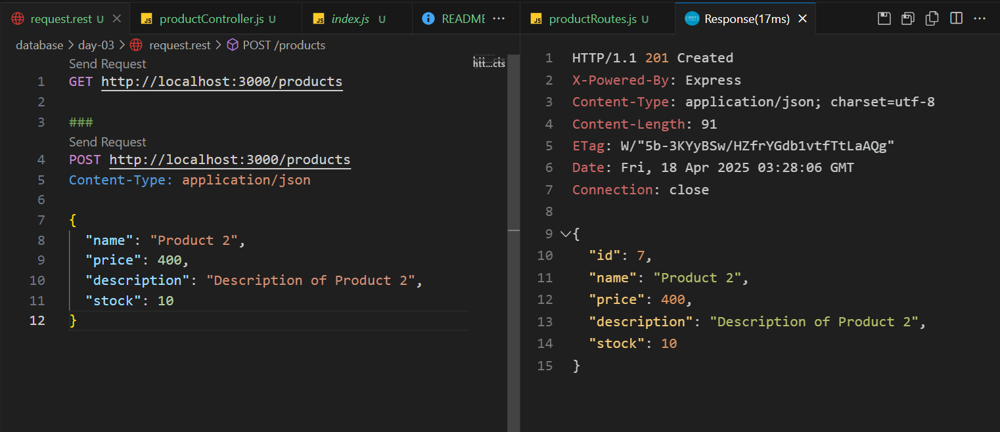

# Giải thích Day3

Các bước để chạy dự án:
1. cd vào foler `day-03`
2. Chạy lệnh `node seed.js` để seed data mẫu vào (do project đang chạy local nên phải có sẵn schema tương tự bên dưới mới seed được data)
3. `npm i`
4. `npm start` để chạy dự án

---

## 1. Tạo database mới và bảng `product`

Giải thích:
- Database: `tigren`
- Lệnh SQL tạo table `product`:
```
CREATE TABLE products (
    id INT AUTO_INCREMENT PRIMARY KEY,
    name VARCHAR(255),
    price FLOAT,
    description TEXT,
    stock INT
);
```

## 2. Cấu hình kết nối database trong project Node.js sử dụng thư viện `mysql2`
1. File `src/db.js`:
```
import mysql from "mysql2";
import dotenv from "dotenv";

dotenv.config();

const db = mysql.createConnection({
  host: process.env.DB_HOST,
  user: process.env.DB_USER,
  password: process.env.DB_PASSWORD,
  database: process.env.DB_NAME,
});

db.connect((err) => {
  if (err) {
    console.error("Error connecting to the database:", err);
    return;
  }
  console.log("Connected to the database");
});

export default db;
```

**Kết quả (Connect thành công)**: Chạy lệnh: `npm start` để test


## 3. Viết API & Test API
- Code được trích từ file `src/controllers/productController.js`
- Test API trên file: `request.rest`
---
- **API GET** `/products`: Lấy toàn bộ sản phẩm từ bảng products và trả về kết quả dạng JSON.
```
export const getAllProducts = (req, res) => {
  db.query("SELECT * FROM products", (err, results) => {
    if (err) {
      console.error("Error fetching products:", err);
      return res.status(500).json({ error: "Internal server error" });
    }
    res.json(results);
  });
};
```
Kết quả:


- **API POST** `/products`: Thêm mới một sản phẩm vào bảng `products`.
```
export const createProduct = (req, res) => {
  const { name, price, description, stock } = req.body;
  db.query(
    "INSERT INTO products (name, price, description, stock) VALUES (?, ?, ?, ?)",
    [name, price, description, stock],
    (err, results) => {
      if (err) {
        console.error("Error creating product:", err);
        return res.status(500).json({ error: "Internal server error" });
      }
      res.status(201).json({
        id: results.insertId,
        name,
        price,
        description,
        stock,
      });
    }
  );
};
```
Kết quả:


- **API PUT** `/products/:id`: Cập nhật thông tin của sản phẩm dựa trên `id`.
```
export const updateProduct = (req, res) => {
  const { id } = req.params;
  const { name, price, description, stock } = req.body;
  db.query(
    "UPDATE products SET name = ?, price = ?, description = ?, stock = ? WHERE id = ?",
    [name, price, description, stock, id],
    (err, results) => {
      if (err) {
        console.error("Error updating product:", err);
        return res.status(500).json({ error: "Internal server error" });
      }
      if (results.affectedRows === 0) {
        return res.status(404).json({ error: "Product not found" });
      }
      res.json({
        id,
        name,
        price,
        description,
        stock,
      });
    }
  );
}
```
Kết quả:


- **API DELETE** `/products/:id`: Xóa sản phẩm dựa trên `id`.`
```
export const deleteProduct = (req, res) => {
  const { id } = req.params;
  db.query("DELETE FROM products WHERE id = ?", [id], (err, results) => {
    if (err) {
      console.error("Error deleting product:", err);
      return res.status(500).json({ error: "Internal server error" });
    }
    if (results.affectedRows === 0) {
      return res.status(404).json({ error: "Product not found" });
    }
    res.status(200).json({ message: "Product deleted successfully" });
  });
}
```
Kết quả:
