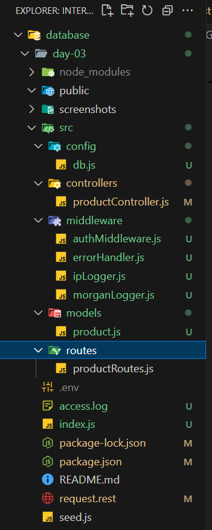
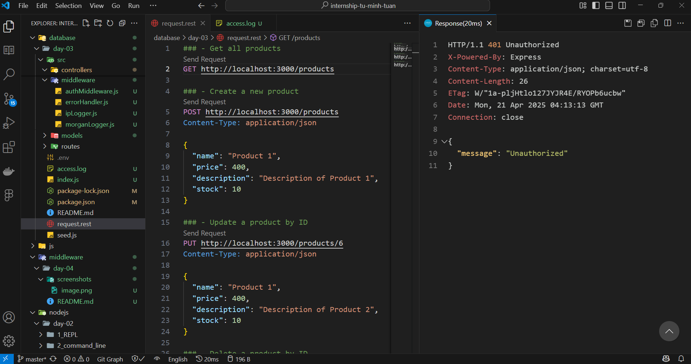
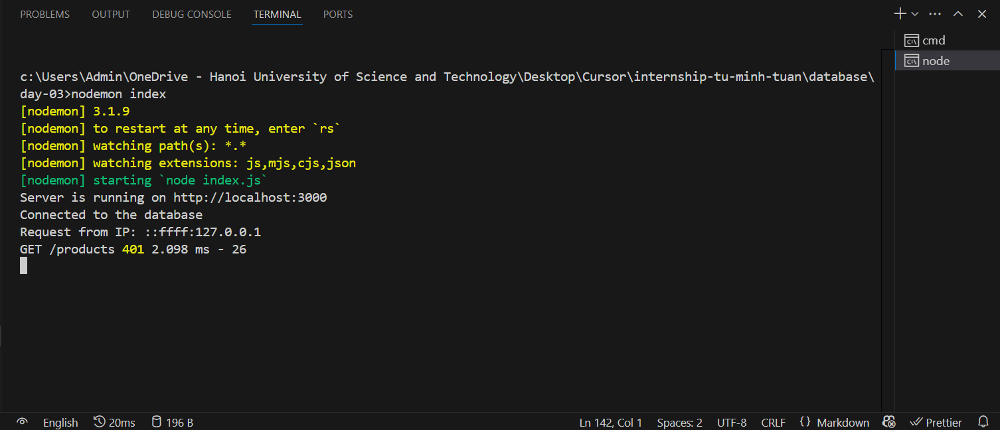
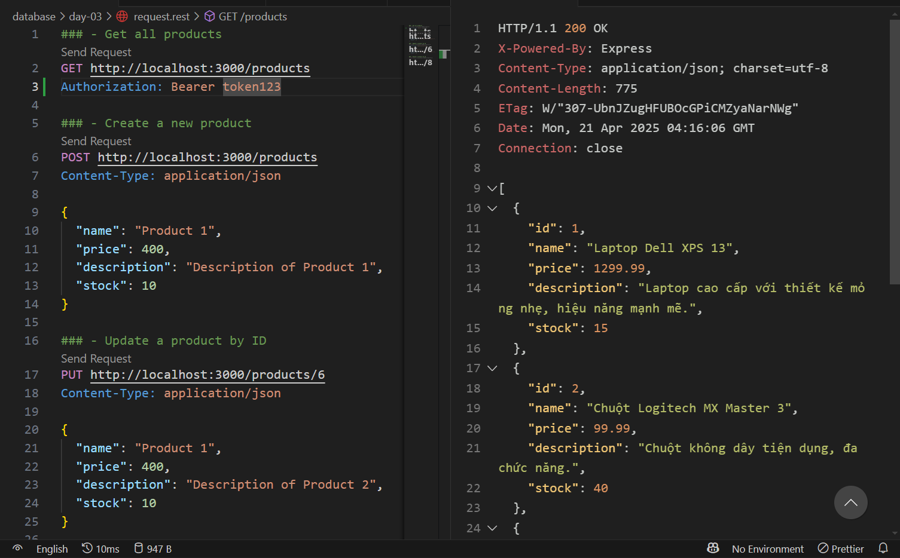
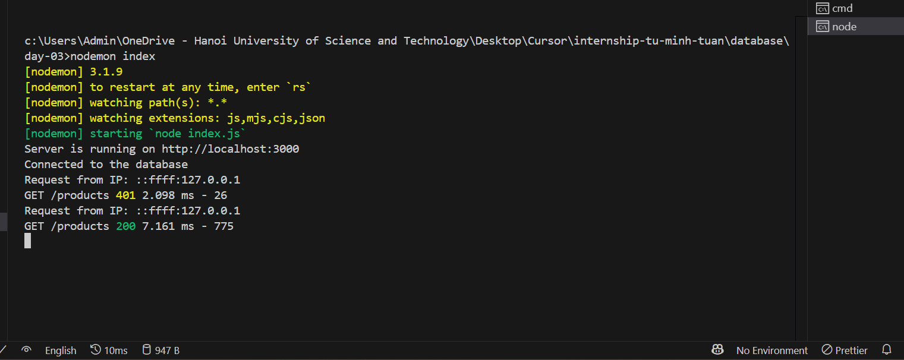

# Giải thích Day4 - Middleware, Error Handling, Logger trong Express.js

**Mục tiêu:**
- Hiểu rõ `Middleware` là gì, cách hoạt động và ứng dụng thực tế
- Biểu cách xử lý lỗi đúng chuẩn `RESTful API`
- Làm quen với `logger: console.log` và thư viện `Morgan`

---
## 1. Lý thuyết

**1. Middleware là gì?**

- Định nghĩa: Là các `hàm trung gian` có thể can thiệp vào request - response cycle. Nó nhận `req, res và next()`.

Code ví dụ:
```
app.use((req, res, next) => {
  console.log('Đây là middleware');
  next(); // bắt buộc để tiếp tục sang bước tiếp theo
});
```

**Flow**: ➡️ Middleware 1 ➡️ Middleware 2 ➡️ Route Handler ➡️ Response

**Các loại middleware phổ biến**:
- Application middleware: `app.use()` xử lý logic chung
- Router middleware: Gắn riêng cho một router
- Error-handling: Bắt lỗi, format lỗi chuẩn REST
- Built-in middleware: `express.json()`, `express.static()`
- `Third-party middleware`: `morgan`, `cors`, `helmet`,...

**2. Lý thuyết về** `morgan`

`morgan` là một **HTTP request logger middleware** dùng trong `Node.js/Express`. Nó ghi lại thông tin về các request gửi đến server như:
- Phương thức HTTP (`GET`, `POST`, ...)
- URL
- Mã trạng thái trả về (`200`, `404`, ...)
- Thời gian xử lý request
- Kích thước response

Các format log có sẵn:
- `dev`: Màu sắc, ngắn gọn, dễ nhìn. Phù hợp cho dev
- `combined`: Chuẩn Apache, ghi đầy đủ (dùng cho production)
- `common`: Giống combined nhưng ngắn hơn
- `short`: Ghi ngắn, không màu
- `tiny`: Rất ngắn, chỉ có method, URL, status và thời gian

Các token thông dụng:
- `method`: Phương thức HTTP
- `url`: Đường dẫn URL 
- `:status`: Mã trạng thái HTTP
- `:response-time`: Thời gian phản hồi (ms)
- `:date`: 	Thời gian hiện tại
- `:remote-addr`: IP client gửi request
- `:user-agent`: Trình duyệt của client

**3. Error Handling chuẩn RESTful**

**Nguyên lý:**
- `Expres`s xử lý lỗi qua middleware đặc biệt có **4 tham số**: `(err, req, res, next)`
- Trả về mã lỗi phù hợp REST: 400, 401, 404, 500...

**Ví dụ**:
```
app.use((err, req, res, next) => {
  console.error(err.stack);

  res.status(err.status || 500).json({
    error: true,
    message: err.message || 'Internal Server Error',
  });
});
```

**Tips:** (Mã HTTP - Lỗi)
- 400: Validate lỗi input
- 401/403: Không có quyền
- 404: Không tìm thấy
- 500: Lỗi server

**4. Logger - Ghi log để dễ debug**
- Sử dụng `morgan`:
```
const morgan = require('morgan');
app.use(morgan('dev'));
```
- Ghi log vào file:
```
const fs = require('fs');
const path = require('path');
const accessLogStream = fs.createWriteStream(path.join(__dirname, 'access.log'), { flags: 'a' });

app.use(morgan('combined', { stream: accessLogStream }));
```

---
## 2. Bài tập Week2

**1. Thêm các middleware vào hệ thống API để xử lý các tác vụ như kiểm tra quyền truy cập, log các hoạt động và xử lý lỗi**

- Middleware kiểm tra quyền truy cập (Auth Middleware): Kiểm tra xem request có gửi `authorization` header với giá trị `Bearer token123` hay không. Nếu không có, trả về mã lỗi `401 Unauthorized`.
```
// database/day-03/src/middleware/authMiddleware.js
export const authMiddleware = (req, res, next) => {
  const token = req.headers["authorization"];
  if (!token || token !== "Bearer token123") {
    return res.status(401).json({ message: "Unauthorized" });
  }
  next();
};
```

- Middleware log IP của người dùng: Middleware này sẽ log địa chỉ IP của người dùng mỗi khi họ gửi yêu cầu đến server. Log sẽ được ghi lại trong log file sử dụng `morgan`.
```
// database/day-03/src/middleware/ipLogger.js
export const ipLogger = (req, res, next) => {
    const ip = req.ip || req.connection.remoteAddress;
    console.log(`Request from IP: ${ip}`);
    next();
}
```

- Middleware xử lý lỗi chung: Tạo một middleware để bắt tất cả lỗi không mong muốn và trả về lỗi chuẩn RESTful. Middleware này sẽ được thêm vào cuối các middleware.
```
// database/day-03/src/middleware/errorHandler.js
export const errorHandler = (err, req, res, next) => {
  console.error("Error:", err.message);
  res.status(err.status || 500).json({
    error: {
      message: err.message || "Internal Server Error",
    },
  });
};
```

**2. Sử dụng morgan để log thông tin các request HTTP với các loại log cơ bản**

```
// database/day-03/src/middleware/morganLogger.js
import morgan from "morgan";
import fs from "fs";
import path from "path";

const accessLogStream = fs.createWriteStream(path.join("access.log"), { flags: "a" });

export const devLogger = morgan("dev");
export const fileLogger = morgan("combined", { stream: accessLogStream });
```

Cấu hình `morgran` để log requets theo các mức độ khác nhau:
- `dev`: Hiển thị thông tin ngắn gọn, dễ đọc trên console.
- `combined`:  Log chi tiết hơn, thông tin về địa chỉ IP, URL, mã phản hồi và thời gian yêu cầu.

**3. Cấu trúc lại thư mục của dự án để dễ quản lý và mở rộng**

Project sau khi đã cấu trúc lại thư mục:



**4. Kiểm thử các API và chụp ảnh kết quả**

**Kết quả khi kiểm thử không có token (Gọi API `GET /products`)**:




Giải thích:
- `message: "Unauthorized"` đến từ file `authMiddleware.js` (do không có token)
- `Request from IP: ::ffff:127.0.0.1` ám chỉ `localhost`
- `GET /products 401 2.098 ms - 26`: 401 - HTTP status code (401 = Unauthorized), 2.098 ms - Thời gian xử lý request, 26 - Kích thước tính bằng `byte` của response
- Còn `file access.log` dưới đây thì được ghi từ `morgan` format log `combined`
```
// access.log
::ffff:127.0.0.1 - - [21/Apr/2025:04:13:13 +0000] "GET /products HTTP/1.1" 401 26 "-" "vscode-restclient"
```

**Kết quả kiểm thử khi có token chính xác (`Bearer token123`) (Gọi API `GET /products`)**:




Cũng giải thích tương tự như ở bên trên!

```
// access.log
::ffff:127.0.0.1 - - [21/Apr/2025:04:16:06 +0000] "GET /products HTTP/1.1" 200 775 "-" "vscode-restclient"
```