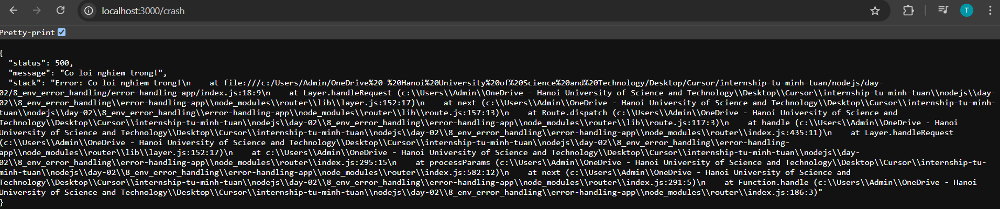

# Giải thích Day2

## 1. Phần 11: REPL

**Câu 1**: REPL là gì?
**REPL (Read Eval Print Loop)** hiểu đơn giản là **Đọc - Đánh giá - In - Lặp** và nó là môi trường như màn hình console nơi gõ các lệnh và hệ thống sẽ trả về kết quả. REPL cung cấp một cách thuận tiện để kiểm tra nhanh mã `JavaScript` đơn giản. `Node.js` cũng có môi trường REPL, nó hoạt động như sau:
- R (Read): Đọc input của người dùng
- E (Eval): Đánh giá/thực thi input đó
- P (Print): In kết quả ra màn hình
- L (Loop): Lặp lại quá trình trên

**Câu 2**: Biến `_` trong REPL để làm gì?
Biến `_` trong REPL được sử dụng để lưu trữ kết quả của biểu thức được tính toán gần nhất. Ví dụ:


**Câu 3**:Các lệnh đặc biệt như `.help`, `.exit` dùng khi nào?
- `.help`: Hiển thị danh sách tất cả các lệnh
- `.exit`: Thoát khỏi môi trường REPL
- `Tab`: có 2 tác dụng chính. Thứ nhất là gợi í và hoàn thành tên biến, phương thức và thuộc tính. Thứ hai là `Tab` hai lần liên tiếp sẽ hiển thị tất cả các biến và phương thức có sẵn trong context hiện tại


Khi nhấn `Tab` 2 lần:


**Bài tập**
1. Mở REPL (node) → thử khai báo biến, dùng `_`, `Tab`, `.help`.


2. Tạo một file `repl_helper.js` khởi chạy custom REPL:
- Gợi ý (autocomplete) các lệnh tự tạo: `sayHi`, `now`, `sum(a,b)`
- Khi gõ `.save` thì lưu lịch sử REPL vào file `history.txt`
- Chạy code: cd vào folder `REPL` + `node repl_helper`
```
// repl_helper.js
// Custom REPL
const repl = require("repl"); //  Module gốc của Node.js để tạo ra một phiên REPL (Read-Eval-Print Loop)
const fs = require("fs"); // Xử lý file
const path = require("path");

const completions = ["sayHi", "now", "sum"];

// Gợi í lệnh (autocomplete) cho REPL Custom
// Tổng quát: completer(line) => [suggestions, originalLine]
function completer(line = "") {
  try {
    const hits = completions.filter((c) =>
      c.toLowerCase().startsWith(line.toLowerCase())
    );
    return [hits.length ? hits : completions, line];
  } catch (err) {
    console.error("Lỗi trong completer:", err.message);
    return [[], line];
  }
}

const r = repl.start({
  prompt: ">> ", // Giao diện dòng lệnh hiển thị (giống như >, ở đây custom thành >>)
  ignoreUndefined: true, // Bỏ qua các giá trị undefined trong đầu ra
  completer: completer,
});

// Thêm các hàm vào context, r.context là nơi lưu tất cả các biến và hàm có sẵn trong REPL
r.context.sayHi = () => console.log("Hello from REPL Custom by TMTuan!"); // Hàm sayHi
r.context.now = () => new Date(); // Hàm now
r.context.sum = (a, b) => a + b; // Hàm sum

// Lưu lịch sử khi dùng .save
// defineCommand(name, object): Dùng để tạo lệnh đặc biệt trong REPL bắt đầu bằng dấu . như .save
r.defineCommand("save", {
    help: "Save history to file history.txt",
    // action(): Là hàm thực thi khi người dùng gõ .save.
    action () {
        const histFile = path.join(__dirname, "history.txt"); // Đường dẫn đến file history.txt
        fs.writeFileSync(histFile, r.lines.join("\n")); // Ghi lại lịch sử vào file history.txt
        console.log(`History saved in ${histFile}`);
        
        this.displayPrompt(); // Hiển thị lại dấu nhắc lệnh sau khi lưu
    }
});
```
Minh hoạ chạy thử:


## 2. Phần 12–14: Command line
**Câu 1**: Làm sao nhận input từ `process.argv`?
>`process.argv` là một array trong Node.js chứa các tham số được truyền khi bạn chạy chương trình từ dòng lệnh.


Vì sao lại cần `process.argv`:
- Để nhận đối số từ dòng lệnh
- Dùng cho các công cụ CLI, tool dòng lệnh, script tự động
- Giúp chương trình linh hoạt hơn (không cần chỉnh sửa code khi muốn nhập khác)

Làm sao để nhận input từ `process.argv`: `process.argv[2+]` là các đối số ta truyền vào

**Câu 2**: Khác biệt giữa `stdout` và `stderr`?
Trong bất kỳ chương trình dòng lệnh (CLI) nào đều có 3 luồng (streams) mặc định là:
- stdin, nhận dữ liệu từ bàn phím (input)
- stdout, gửi dữ liệu ra màn hình (output thường)
- stderr, gửi thông báo lỗi ra màn hình

Khác biệt giữa `stdout` và `stderr`?
- `stdout`: Dùng để in các thông báo bình thường mà bạn muốn người dùng thấy. Lệnh thường dùng `console.log`
- `stderr`: Dùng để in thông báo lỗi hoặc cảnh báo, tách biệt khỏi kết quả thông thường. Lệnh thường dùng `console.error`

**Câu 3**: Cách dùng `readline`?
`readline` là một module có sẵn trong `Node.js`, dùng để:
-  Tạo ra giao diện tương tác với người dùng thông qua dòng lệnh (command line)
- Cho phép chương trình nhận input từ bàn phím (qua stdin) và hiển thị phản hồi ra màn hình (qua stdout)

Cách dùng `readline`:
- Interface: Tạo một "giao diện" để đọc từng dòng văn bản nhập vào từ người dùng.
- Input, output (thường là process.stdin, process.stdout)
- Phương thức question(): Đặt câu hỏi và chờ người dùng nhập câu trả lời.
- Sự kiện line và close: Dùng để xử lý dòng được nhập và kết thúc chương trình. 

**Bài tập**
1. Viết file `sum.js` tính tổng 2 số từ dòng lệnh. (Chạy code `node sum.js 1 2`, với 1 và 2 là đối số truyền vào)
```
// sum.js
const a = Number(process.argv[2]);
const b = Number(process.argv[3]);

console.log(`Tong cua ${a} va ${b} la: ${a + b}`);
```
Kết quả:


2. Dùng `readline` hỏi tên và in ra `Hello <tên>`. (`node hello.js`)
```
// hello.js
const readline = require('readline');

const rl = readline.createInterface({
    input: process.stdin,
    output: process.stdout,
});

rl.question('Nhap ten cua ban: ', (name) => {
    console.log(`Hello ${name}`);
    rl.close();
});
```
Kết quả


3. Bài tập nâng cao (`node csv-summarizer.js data.csv`)
```
// csv-summarizer.js
const fs = require("fs");
const path = require("path");

// Lấy đường dẫn file CSV từ tham số dòng lệnh
const filePath = process.argv[2];

// Đọc file CSV
let data;
try {
  data = fs.readFileSync(filePath, "utf8");
} catch (error) {
  console.error("Loi khi doc file .csv:", error.message);
  process.exit(1);
}

// Phân tích dữ liệu CSV
const lines = data.trim().split("\n");
const headers = lines[0].split(",").map((h) => h.trim()); // Map để loại bỏ khoảng trắng, tương đương ["name", "salary"]

// Tách data thành mảng 2 chiều
// slice(1) để bỏ qua headers
const rows = lines
  .slice(1)
  .map((line) => line.split(",").map((value) => value.trim()));
console.log("rows", rows);

// Tạo object để lưu trữ kết quả
const summary = {};
headers.forEach((header, index) => {
  // Kiểm tra xem cột có phải là số không bằng cách kiểm tra giá trị đầu tiên
  const firstValue = Number(rows[0][index]);
  if (!isNaN(firstValue)) {
    summary[header] = { sum: 0, count: 0 };
    rows.forEach((row) => {
      const value = Number(row[index]);
      summary[header].sum += value;
      summary[header].count++;
    });
  }
});
console.log(summary)
// In bảng kết quả (Tham khảo từ ChatGPT)
console.log("\nSummary of Numeric Columns\n");
console.log("+----------------+------------+------------+");
console.log("|    Column      |    Sum     |  Average   |");
console.log("+----------------+------------+------------+");

// Destructuring [col, { sum, count }]
// Object.entries(summary) chuyển object thành mảng các cặp [key, value]
for (const [col, { sum, count }] of Object.entries(summary)) {
  const avg = sum / count;
  console.log(
    `| ${col.padEnd(14)} | ${sum.toString().padStart(10)} | ${avg
      .toFixed(2)
      .toString()
      .padStart(10)} |`
  );
}
console.log("+----------------+------------+------------+");
```
Kết quả:


## 3. Phần 15–27: npm & npx
**Câu 1**: `dependencies` vs `devDependencies`?
- `dependencies`: là các gói mà ứng dụng yêu cầu trong quá trình sản xuất, cài đặt: `npm install <package>`
- `devDependencies`: Các gói chỉ cần thiết cho việc phát triển mà thử nghiệm cục bộ (nodemon, eslint, vite), cài đặt: `npm install <package> --save-dev hoặc -D`

**Câu 2**: Khi nào dùng `npx`?
`npx` là công cụ CLI đi kèm với `npm` giúp **chạy trực tiếp một package mà không cần cài đặt toàn cục**.
Ví dụ: Có 2 cách để chạy `prisma studio`:
- Cách 1 là cài toàn cục: (Không phổ biến lắm do gây rác hệ thống, dễ gây lỗi version nếu dùng nhiều project)
```
npm install -g prisma
prisma studio
```
- Cách 2 là dùng `npx`: `npx prisma studio`, npx sẽ kiểm tra trong node_modules xem đã cài prisma hay chưa, nếu cài rồi sẽ dùng bản cục bộ để chạy. Nếu chưa cài npx sẽ tải gói prisma tạm thời và chạy lệnh studio, gói này sẽ bị xoá sau khi chạy xong.

Ưu điểm của `npx`: chạy tool nhanh, tránh rác hệ thống, dễ thử version khác nhau

**Câu 3**: Tác dụng của `package-lock.json`?
Là file tự động tạo bởi `npm`, dùng để ghi lại chính xác **version** và **cấu trúc phụ thuộc** của toàn bộ thư viện trong dự án, file này ghi lại:
- Phiên bản **chính xác** của từng package
- Cấu trúc cây phụ thuộc
- URL tải về từng package

Tác dụng chính:
- Đảm bảo cài đúng `version` trên mọi máy -> Tránh lỗi xung đột version
- Tăng tốc cài đặt do npm dùng cache từ `package-lock.json`

**Bài tập**:
1. Bài tập nhỏ: Tạo `package.json`, cài `chalk`, in dòng màu, tạo script hello-cli gọi bằng npx.
`package.json`:

- cd vào folder `hello-cli`
- `npm i`
- `npx hello-cli`

`hello.js`:
```
#!/usr/bin/env node
// giúp file này có thể chạy như một lệnh trong terminal (nếu được gọi bằng npx hoặc đã cấp quyền thực thi)

import chalk from "chalk";

console.log(chalk.green('Hello from your CLI tool!'));
console.log(chalk.blue.bold('This text is blue and bold.'));
console.log(chalk.red('Let\'s go!'));
```
2. Bài tập nâng cao (folder slugify-cli)
- cd vào folder `slugify-cli`
- `npm i`
- `npx slugify-cli Từ Minh Tuân` (Đối số thứ 3 thay bằng chuỗi tuỳ chỉnh)

```
// bin/index.js

#!/usr/bin/env node
// Dòng #!/usr/bin/env node để file CLI chạy bằng npx.
import slugify from "../lib/slugify.js";

// slice(2) để bỏ qua 2 tham số đầu tiên là đường dẫn đến node và đường dẫn đến file script
// join(" ") để nối các tham số lại thành một chuỗi
const input = process.argv.slice(2).join(" ");

const output = slugify(input);
console.log(output);
```

```
// lib/slugify.js
function slugify(string) {
  return string
    .normalize("NFD") // Chuẩn hóa Unicode
    .replace(/[\u0300-\u036f]/g, "") // Xóa dấu
    .toLowerCase() // Chuyển thành chữ thường 
    .trim() // Xóa khoảng trắng đầu cuối
    .replace(/[^a-z0-9 -]/g, "") // Chỉ giữ lại chữ thường, số và dấu gạch ngang
    .replace(/\s+/g, "-") // Thay khoảng trắng bằng dấu gạch ngang
}

export default slugify;
```

Kết quả:


## 4. Phần 28–32: Event Loop

**Câu 1**: `process.nextTick()` vs `setTimeout()?`
- `process.nextTick()`: Ưu tiên ngay lập tức, thường dùng cho callback kế tiếp.
- `setTimeout()`: Dù delay = 0, vẫn lùi lại ít nhất 1 vòng event loop
```
console.log('Start');

process.nextTick(() => {
    console.log('Next Tick Callback');
});

setTimeout(() => {
    console.log('Timeout Callback');
}, 0);

console.log('End');
```
Kết quả:


Giải thích:
- `console.log('Start') và 'End'` là đồng bộ, chạy đầu tiên.

- `process.nextTick()` sẽ chạy ngay sau code đồng bộ, trước cả `setTimeout()` dù delay là 0.


**Câu 2**: Stack và queue khác gì nhau?
- Stack: LIFO (Last In, First Out), dùng để gọi hàm, thực thi lệnh (Call Stack)
- Queue: FIFO (First In, First Out), thường dùng xử lý event/callback/asynchronous tasks

Trong JavaScript:
- Stack dùng cho xử lý đồng bộ.
- Queue dùng cho xử lý bất đồng bộ (event/callback queue).

**Câu 3**: Dùng `setImmediate()` khi nào?
`setImmediate()` là một API của Node.js dùng để **thực hiện callback bất đồng bộ**, sau khi I/O đã hoàn tất hoặc **ngay sau vòng lặp hiện tại của event loop**.

Khi nào dùng `setImmediate()`:
- Khi muốn hoãn một tác vụ đến vòng event loop kế tiếp, nhưng sau I/O
- Khi cần tránh chặn luồng chính hoặc call stack bị đầy
- Khi bạn cần thực thi một callback ngay sau các tác vụ I/O (fs, net, stream, etc.)

>`Ưu tiên: process.nextTick() (Trước bất kỳ task bất đồng bộ nào) > setImmediate() (	Sau I/O, trước setTimeout)> setTimeout(fn, 0)`

**Bài tập**
1. Viết đoạn code so sánh thứ tự log của `nextTick`, `setTimeout`, `setImmediate`
(`node eventLoop.js`)
```
// eventLoop.js
console.log('Start');

setTimeout(() => {
  console.log('setTimeout');
}, 0);

setImmediate(() => {
  console.log('setImmediate');
});

process.nextTick(() => {
  console.log('process.nextTick');
});

console.log('End');
```

Kết quả: 


2. Bài tập nâng cao: Viết script đo thời gian thực thi:

- Mỗi lần chạy sẽ tạo 100 setTimeout(fn, 0), setImmediate, process.nextTick.
- Ghi lại thứ tự thực thi và tổng thời gian mất bao lâu.
- Bonus: Cho phép config số vòng lặp bằng tham số dòng lệnh.
- Chạy code: `node execetion-timing 5`, với 5 là số lần lặp nếu không chỉ định thì mặc định là 100.

```
// execution-timing.js
const { performance } = require("perf_hooks");

// Nhận tham số vòng lặp từ dòng lệnh, mặc định là 100
const iterations = parseInt(process.argv[2]) || 100;

const log = [];
const start = performance.now();

let count = 0;
function checkDone() {
  count++;
  if (count === iterations * 3) {
    const end = performance.now();
    console.log(`\n--- Kết quả sau ${iterations} vòng ---`);
    console.log(log.join("\n"));

    console.log(`\nTổng thời gian: ${(end - start).toFixed(2)} ms`);
  }
}

for (let i = 0; i < iterations; i++) {
  process.nextTick(() => {
    log.push(`nextTick [${i}]`);
    checkDone();
  });

  setTimeout(() => {
    log.push(`setTimeout [${i}]`);
    checkDone();
  }, 0);

  setImmediate(() => {
    log.push(`setImmediate [${i}]`);
    checkDone();
  });
}
```
Kết quả:


Nhận xét: `setTimeout` và `setImmediate` **không đảm bảo thứ tự tuyệt đối** nếu không có I/O blocking.

## 5. Phần 33-40: fs, path, os
**Câu 1**: `fs.readFileSync()` vs `fs.readFile()`
- `fs.readFileSync(path)`: Đồng bộ, khi muốn đọc file **ngay lập tức** và **chấp nhận** việc tạm dừng các thao tác khác trong chương trình
- `fs.readFile(path)`: Bất đồng bộ, khi muốn đọc file **không chặn** luồng xử lý chính. Trong thực tế luôn ưu tiên hàm này

**Câu 2**: `path.join(...)` dùng để làm gì
Dùng để nối các phần của đường dẫn thành 1 đường dẫn hoàn chỉnh, tự động xử lý dấu `/` hoặc `\` tùy theo hệ điều hành.

**Lý do dùng**: Viết code đa nền tảng mà không cần lo lắng về dấu `/` hay `\`.
Ví dụ:
```
const path = require('path');
const fullPath = path.join(__dirname, 'data', 'file.txt');
console.log(fullPath);
```
Trả về sẽ có dạng: `C:\project\data\file.txt`

**Câu 3**: Dùng `os.totalmem()` để làm gì?
Trả về **tổng dung lượng RAM vật lý** (tính bằng byte) của máy tính bạn đang chạy. (`node os.js`)
```
// os.js
const os = require('os');
console.log(`Ram: ${os.totalmem() / 2 ** 30} GB`);
```
Kết quả:


**Bài tập**:
1. Viết script ghi `log.txt` với dòng Hello at <timestamp>. (`node write-log.js`)
```
// write-log.js
const fs = require("fs");
const path = require("path");

const logPath = path.join(__dirname, "log.txt");
const timestamp = new Date().toISOString();

const logMessage = `Hello at ${timestamp}\n`;
fs.appendFileSync(logPath, logMessage, "utf-8");
console.log(`Log written to log.txt`);
```
Kết quả:
```
// log.txt
Hello at 2025-04-16T08:42:05.861Z
```

2. Viết công cụ `log-archiver.js`:
- Lấy tất cả file .log trong thư mục /logs
- Đổi tên theo format log_YYYYMMDD_HHMM.log
- Nén các log này thành .zip → /archives
- Chạy code: `node log-archiver`

```
// log-archiver/log-archiver.js

const fs = require("fs/promises"); // Dùng promise-based API để làm việc với file
const fss = require("fs"); // Dùng để tạo stream (read/write stream)
const path = require("path"); // Xử lý đường dẫn file (nối, tách, định dạng)
const zlib = require("zlib"); // Dùng để nén file với Gzip, Deflate, Brotli, v.v.
const { pipeline } = require("stream"); // Dùng để kết nối các stream lại với nhau
const { promisify } = require("util"); // Biến callback-style function thành promise

const pipe = promisify(pipeline); // Chuyển đổi pipeline thành promise để dễ dàng sử dụng async/await

// Directory Setup
const logsDir = path.join(__dirname, "logs");
const archivesDir = path.join(__dirname, "archive");

function formatDate(date) {
  const pad = (n) => String(n).padStart(2, "0");
  const year = date.getFullYear();
  const month = pad(date.getMonth() + 1);
  const day = pad(date.getDate());
  const hour = pad(date.getHours());
  const minute = pad(date.getMinutes());
  
  return `${year}${month}${day}_${hour}${minute}`;
}

async function renameLogs() {
  const files = await fs.readdir(logsDir);
  const renamedFiles = [];

  // Đọc tất cả file trong thư mục logs
  for (const file of files) {
    if (file.endsWith(".log")) {
      // Lọc ra các file có đuôi .log
      const fullPath = path.join(logsDir, file);
      const stat = await fs.stat(fullPath);
      const date = new Date(stat.mtime);
      const formatted = `log_${formatDate(date)}.log`;
      // // Đổi tên file và lưu tên mới
      await fs.rename(fullPath, path.join(logsDir, formatted));
      renamedFiles.push(formatted);
    }
  }
  return renamedFiles;
}

async function archiveLogs(logFiles) {
  const date = new Date();
  const formattedDate = formatDate(date);
  const zipPath = path.join(archivesDir, `logs_${formattedDate}.zip`);
  
  const output = fss.createWriteStream(zipPath);
  const gzip = zlib.createGzip();

  const archiveStream = require("stream").PassThrough();

  // Tạo stream đọc lần lượt các log  
  (async () => {
    for (const file of logFiles) {
      const filePath = path.join(logsDir, file);
      const content = await fs.readFile(filePath, "utf8");
      archiveStream.write(`\n--- ${file} ---\n`);
      archiveStream.write(content);
    }
    archiveStream.end();
  })();

  await pipe(archiveStream, gzip, output);
  console.log(`Archived logs to ${zipPath}`);
}

(async () => {
  try {
    await fs.mkdir(archivesDir, { recursive: true });

    const renamedLogs = await renameLogs();
    if (renamedLogs.length === 0) {
      console.log("No logs to archive.");
      return;
    }

    await archiveLogs(renamedLogs);
  } catch (err) {
    console.error("Error:", err);
  }
})();
```
Kết quả:


## 6. Phần 41-43: Event & HTTP

**Câu 1**: `emitter.on() vs once()?`

`1. emitter.on(eventName, listener)`:
- Dùng khi bạn muốn xử lý sự kiện **nhiều lần**, ví dụ: lắng nghe sự kiện kết nối liên tục..
- Cách hoạt động: Listener sẽ được gọi **mỗi lần** sự kiện `eventName` được phát (`emit`)

`2. emitter.once(eventName, listener)`:
- Sự kiện `eventName` chỉ được gọi **một lần duy nhất**
- Cách hoạt động: Listener sẽ được gọi **chỉ lần đầu tiên**, sau đó listener này tự động gỡ bỏ (Chat app, Socket,..)
- Dùng khi muốn xử lý sự kiện một lần duy nhất, ví dụ: khởi tạo, xác thực một lần hoặc sự kiện chỉ xảy ra đúng 1 lần trong vòng đời chương trình (kết nối db, ..)
- `node event-emitter.js`
```
// event-emitter.js
const EventEmitter = require('events');
const emitter = new EventEmitter();

// Sử dụng .on() - lắng nghe nhiều lần
emitter.on("click", () => {
    console.log("Click event handle by .on()");
});

// Sử dụng .once() - Lắng nghe 1 lần
emitter.once("click", () => {
    console.log("Click event handle by .once()");
});

// Phát sự kiện
emitter.emit("click"); // In ra cả 2 message

// Chỉ in ra message của .on()
// vì .once() đã được xóa bỏ sau khi phát sự kiện đầu tiên
emitter.emit("click");
```

Kết quả:


**Câu 2**: Tạo server đơn giản bằng `http.createServer()?`
- `http`: Tạo máy chủ HTTP
- `node http-server.js`
```
// http-server.js
const http = require('http');

http.createServer((req, res) => {
    // writeHead(statusCode, headers) là phương thức dùng để: gửi mã trạng thái + tiêu đề
    res.writeHead(200, { 'Content-Type': 'text/plain' });
    // end() là phương thức dùng để: gửi nội dung phản hồi và kết thúc phản hồi
    res.end('Hello World');
}).listen(3000, () => {
    console.log('Server running at http://localhost:3000');
});
```

Kết quả:


**Câu 3**: `Cách dùng http.request()?`
`node  http-request.js`
```
// http-request.js
const http = require("http");

// Cấu hình options cho requet
const options = {
  hostname: "jsonplaceholder.typicode.com",
  path: "/posts/1",
  method: "GET",
};

// Tạo request
const req = http.request(options, (res) => {
    console.log(`Status Code: ${res.statusCode}`);

    let data = '';
    // Nhận dữ liệu từ response
    res.on('data', (chunk) => {
        data += chunk;
    })

    // Kết thúc response
    res.on('end', () => {
        console.log('Response:', JSON.parse(data));
    });

    // Xử lý lỗi nếu có
    res.on('error', (error) => {
        console.error('Error:', error);
    });
})

req.end(); // Kết thúc request
```

Kết quả:


**Bài tập**:

1. Viết `EventEmitter` custom → log khi event xảy ra + Server đơn giản `/hello` trả về chuỗi.

> File .log (log file) thường được sử dụng để ghi lại thông tin hoạt động (logs) của hệ thống, ứng dụng, hoặc server. Đây là một phần rất quan trọng trong việc theo dõi và bảo trì ứng dụng. `Ví dụ: [2025-04-17T10:21:00Z] ERROR: Cannot connect to database!`

Chạy code: `node customEventEmitter.js`

```
// customEventEmitter.js
const fs = require('fs');
const EventEmitter = require('events');
const http = require('http');

// EventEmitter custom
class MyEmitter extends EventEmitter {}
const myEmitter = new MyEmitter();

myEmitter.on('request', (message) => {
    console.log(`[LOG] Request event: ${message}`);
    fs.appendFileSync('event.log', `[${new Date().toISOString()}] Request event: ${message}\n`);
});

// Tạo server đơn giản /hello => trả về chuỗi
const server = http.createServer((req, res) => {
    if (req.url === '/hello') {
        myEmitter.emit(`request`, `Access ${req.url}`);
        res.writeHead(200, { 'Content-Type': 'text/plain' });
        res.end('Hello from custom server!');
    } else {
        res.writeHead(404, { 'Content-Type': 'text/plain' });
        res.end('Not Found');
    }
});

server.listen(3000, () => { 
    console.log('Server is running at http://localhost:3000');
});
```
Kết quả:

```
// event.log
[2025-04-17T03:02:04.436Z] Request event: Access /hello
```

2. Viết HTTP server **không dùng Express**:
- Route `POST /upload` nhận file bằng multipart/form-data (gợi ý dùng `busboy`)
- Khi upload xong, emit sự kiện `upload:done`, ghi log lại vào file `uploads.log`.

Chạy project:
- cd `upload-server`
- `npm i`
- Chạy lệnh `curl -F "file=@test.txt" http://localhost:3000/upload`

```
// upload-server/server.js
const http = require("http");
const Busboy = require("busboy");
const fs = require("fs");
const path = require("path");
const EventEmitter = require("events");

// Create uploads directory if it doesn't exist
const uploadDir = path.join(__dirname, "uploads");
if (!fs.existsSync(uploadDir)) {
  fs.mkdirSync(uploadDir);
}

class UploadEmitter extends EventEmitter {}
const uploadEmitter = new UploadEmitter();

// Khi file tải xong, sự kiện "upload:done" được phát
uploadEmitter.on("upload:done", (fileName) => {
  const logEntry = `[${new Date().toISOString()}] File uploaded: ${fileName}\n`;
  console.log(logEntry);
  fs.appendFileSync("upload.log", logEntry);
});

const server = http.createServer((req, res) => {
  if (req.method === "POST" && req.url === "/upload") {
    // busboy để phân tích dữ liệu từ form, headers của request được truyền vào để busboy hiểu định dạng form
    const bb = Busboy({ headers: req.headers });

    // Xử lý file được gửi lên
    bb.on("file", (fieldname, file, fileInfo) => {
      // Use fileInfo.filename instead of filename
      const fileName = fileInfo.filename; // Tên gốc của file
      const saveTo = path.join(__dirname, "uploads", fileName);

      // Dùng fs.createWriteStream() để lưu stream vào đĩa.
      const writeStream = fs.createWriteStream(saveTo);
      // Ghi dữ liệu vào file
      file.pipe(writeStream);

      // Khi file được ghi xong, phát sự kiện "upload:done"
      file.on("end", () => {
        uploadEmitter.emit("upload:done", fileName);
      });
    });

    // Khi busboy đã xử lý xong toàn bộ các phần tử của form, trả về response thành công.
    bb.on("finish", () => {
      res.writeHead(200, { Connection: "close" });
      res.end("File uploaded successfully!");
    });

    // req.pipe(bb) sẽ chuyển dữ liệu từ request vào busboy để phân tích.
    // Điều này cho phép busboy xử lý dữ liệu từ request stream.
    req.pipe(bb);
  } else {
    res.writeHead(404, { "Content-Type": "text/plain" });
    res.end("Route not found");
  }
});

server.listen(3000, () => {
  console.log("Upload server running at http://localhost:3000");
});
```
Kết quả:


## 7. Phần 44: Streams

**Câu 1**: Ưu điểm của stream?
Stream có thể hiểu là 1 chuỗi những mảnh dữ liệu được lắp ghép lại với nhau để tạo ra dòng chảy dữ liệu và chúng được tách ra vận chuyển với một đoạn dữ liệu gọi là - **chunk**.

Stream mang lại nhiều ưu điểm trong Node.js, đặc biệt khi xử lý dữ liệu lớn như file, netwok, video, v.v..:
- Hiệu suất cao (Stream giúp xử lý dữ liệu từng phần nhỏ -  **chunk**) thay vì tải toàn bộ vào bộ nhớ -> Tiết kiệm RAM
- Không chặn luồng xử lý (non-blocking): Dữ liệu được xử lý theo **asynchronous**
- Phù hợp với xử lý file lớn hoặc dữ liệu liên tục

**Câu 2**: `pipe()` làm gì?
Phương thức `.pipe()` dùng để **nối các stream lại với nhau**. Nó giúp chuyển dữ liệu đầu ra của stream này làm đầu vào cho các stream khác.
Ví dụ: (`node index.js`)
```
// index.js
const fs = require('fs');

const readStream = fs.createReadStream('input.txt');
const writeStream = fs.createWriteStream('output.txt');

readStream.pipe(writeStream);
```
Dữ liệu từ input.txt sẽ được đọc và ghi vào output.txt mà không cần load toàn bộ vào bộ nhớ.

**Câu 3**: Có bao nhiêu loại stream?
Node.js có 4 loại stream chính:
- Readable - `fs.createReadStream`
- Writable - `fs.createWriteStream`
- Duplex - vừa đọc vừa ghi trong cùng một thời điểm (ví dụ `net.Socket`)
- Transform - Giống Duplex, nhưng có thể biến đổi dữ liệu trong quá trình Stream (nén file, mã hoá, ...)

**Bài tập**:
1. Đọc `input.txt` → ghi `output.txt` bằng stream. (`node index.js`)
```
// index.js
const fs = require('fs');

const readStream = fs.createReadStream('input.txt');
const writeStream = fs.createWriteStream('output.txt');

readStream.pipe(writeStream);
```
2. Viết công cụ thay thế chuỗi trong file lớn:
- Đọc file lớn bằng stream (`fs.createReadStream`)
- Thay thế "ERROR" thành "⚠️ Warning" và ghi lại vào file mới
- Yêu cầu: xử lý file >100MB mượt mà.
- `node replaceStream.js`
```
// replaceStream.js
const fs = require("fs");
const { Transform } = require("stream");

const inputFilePath = "input2.txt";
const outputFilePath = "output2.txt";

//  Transform stream để thay thế "ERROR" bằng "⚠️ Warning"
const replaceTransform = new Transform({
  transform(chunk, encoding, callback) {
    const chunkString = chunk.toString(); // CHUYỂN buffer thành string
    const replaced = chunkString.replace(/ERROR/g, "⚠️ Warning");
    callback(null, replaced);
  },
});

// Readable và Writable streams
const readStream = fs.createReadStream(inputFilePath, { encoding: "utf8" });
const writeStream = fs.createWriteStream(outputFilePath, { encoding: "utf8" });

// Kết nối các stream lại với nhau
readStream
  .pipe(replaceTransform)
  .pipe(writeStream)
  .on("finish", () => {
    console.log("File processed successfully!!");
  })
  .on("error", (err) => {
    console.error("Error:", err);
  });
```

3. Lý thuyết về `Buffer`:
Là một **vùng nhớ tạm thời** dùng để lưu trữ dữ liệu nhị phân - tức là không phải kiểu string - trong xử lý các tác vụ sau:
- Đọc/ghi file lớn
- Giao tiếp mạng
- Stream audio/video

Ví dụ: Khi đọc một file bằng `fs.createReadStream()`, Node.js sẽ không đọc toàn bộ file một lần, mà sẽ đọc từng phần nhỏ gọi là `chunk`, và mỗi **chunk đó chính là một Buffer**.

## Phần 45-46: ENV & Error Handling

**Câu 1**: Phân biệt `development` và `production`.
- `development`: phục vụ phát triển, test tắng năng, ghi log chi tiết để debug, `NODE_ENV=development`, chưa cần quá chặt chẽ, chưa cần thiết phải tối ưu hiệu suất.
- `production`: chạy trên môi trường người dùng, hạn chế hoặc không log để tránh rò rỉ thông tin, `NODE_ENV=production`, rất quan trọng vấn đề bảo mật và tối ưu hiệu suất.

**Câu 2**: Dùng `try/catch` với `async/await`?
- Khi dùng `async/await`, ta có thể dùng `try/catch` để bắt lỗi **bất đồng bộ** (async error):
- Lý do cần dùng: `await` có thể **throw** lỗi nếu Promise bị rejected, nếu không `try/catch` thì sẽ crash app hoặc không biết lỗi ở đâu.
- Ví dụ về việc sử dụng `try/catch` với `async/await`
```
async function getUser() {
  try {
    const user = await fetchUserFromDB(); // Giả sử đây là async function
    console.log(user);
  } catch (error) {
    console.error('Lỗi khi lấy user:', error);
  }
}
```

**Câu 3**: Bắt `uncaughtException` để làm gì?
`uncaughtException` là một sự kiện `event` được phát ra bởi đối tượng `process` khi một `exception` xảy ra nhưng không được bắt bằng `try/catch`.
Tác dụng chính:
- Ghi lại thông tin lỗi (logging)
- Thực hiện cleanup (đóng database, file, v.v.)
- Thoát ứng dụng một cách có kiểm soát (không để ứng dụng rơi vào trạng thái không xác định)

Khi Node.js gặp lỗi không được bắt (uncaught error), áp sẽ **crash**. Ta dùng `process.on('uncaughtException', handler)`để: ghi log lỗi, dọn dẹp tài nguyên (đóng connect db, file..)

Ngoài ra: Không nên tiếp tục chạy ứng dụng sau `uncaughtException` vì có thể hệ thống đã rơi vào trạng thái không an toàn.

**Bài tâp**:
1. Viết đoạn code chia cho 0 và bắt lỗi. (`node Bai1.js`)
```
// Bai1.js
function divide(a, b) {
  try {
    if (b === 0) {
      throw new Error("Khong the chia cho 0");
    }
    console.log(`Ket qua: ${a / b}`);
  } catch (error) {
    console.error("Error:", error.message);
  }
}

divide(4, 2);
divide(5, 0); // Error: Khong the chia cho 0
```
Kết quả:


2. Tạo middleware xử lý lỗi cho Express:
- Tự bắt lỗi 404, 500
- Log lỗi vào file error.log
- Trả response JSON tùy theo môi trường (dev vs prod)

Chạy code:
- `cd error-handling-app`
- `npm i`
- `node index.js`
- Truy cập vào các route `/crash` và `/ bất kỳ` để test

```
import express from "express";
import fs from "fs";
import path from "path";
import dotenv from "dotenv";

dotenv.config();
const app = express();
const PORT = process.env.PORT || 3000;
const __dirname = path.resolve();

// Middleware: Xử lý route hợp lệ
app.get("/", (req, res) => {
  res.send("Hello World!");
});

// Middleware: Ví dụ gây lỗi 500
app.get("/crash", (req, res, next) => {
  throw new Error("Co loi nghiem trong!");
});

// Middleware: Bắt lỗi 404
app.use((req, res, next) => {
  const error = new Error("Not Found");
  error.status = 404;
  next(error); // Chuyển đến middleware xử lý lỗi
});

// Middleware: Xử lý các lỗi (404, 500)
app.use((err, req, res, next) => {
    const statusCode = err.status || 500;

    // Ghi lỗi ra file error.log
    const logMessage = `[${new Date().toISOString()}] ${statusCode} - ${err.message}\n`;
    fs.appendFileSync(path.join(__dirname, "error.log"), logMessage);

    // Response
    const response = {
      status: statusCode,
      message: err.message,
      // ... dùng để giải phẳng (spread) một object vào trong object cha
      ...(process.env.NODE_ENV === "development" && { stack: err.stack }), // Chỉ hiển thị stack trace trong môi trường dev (err.stack cho biết lỗi xảy ra ở đâu trong code.)
    };

    res.status(statusCode).json(response);
})

app.listen(PORT, () => {
  console.log(`Server is running on port ${PORT}`);
});
```
Tại `development`:



Tại `production`:


## 9. Phần 47-49: HTTP nâng cao

**Câu 1**: GET vs POST khác nhau ở điểm nào?
- GET: Dùng để truy vấn dữ liệu (read-only) dữ liệu gửi qua URL, kém bảo mật hơn POST
- POST: Gửi dữ liệu, tạo mới (create). Dữ liệu gửi qua body, dữ liệu ẩn (không hiển thị trong URL) cho nên nó bảo mật hơn GET


**Câu 2**: Cách lấy body trong POST request?
Trong Express, ta cần middleware để xử lý body của POST request:
- Với `JSON body`: `app.use(express.json());`
- Với `form-urlencoded`: `app.use(express.urlencoded({ extended: true }));`
- Cuối cùng dùng `req.body` là được

**Câu 3**: Dùng `http.ServerResponse` ra sao?
`http.ServerResponse` là đối tượng `res` trong Node.js (thuần), dùng để:
- Gửi status code
- Gửi header
- Gửi dữ liệu về client
- Ví dụ: `res.end`, `res.setHeader`

Trong Express: `res` là mở rộng từ `http.ServerResponse`

**Bài tập**:
1. Tạo server Express có route GET /, POST /data lưu data vào mảng.

Chạy code:
- cd `Bai1`
- `npm i`
- `node index.js`
- Test tương tự như dưới ảnh `request.rest` bên dưới.

```
// Bai1/index.js
import express from "express";

const app = express();
const PORT = 3000;

app.use(express.json()); // Middleware để parse JSON body

const dataStore = [];

app.post("/data", (req, res) => {
  const newData = req.body;

  if (!newData) {
    return res.status(400).json({ error: "Data is required" });
  }

  dataStore.push(newData);
  res.status(201).json({
    message: "Data added successfully",
    currentData: dataStore,
  });
});

app.listen(PORT, () => {
  console.log(`Server is running on port ${PORT}`);
});
```
Kết quả:


2. Tạo REST API quản lý tasks:
- CRUD: /tasks
- Mỗi task có deadline, status
- Tự động kiểm tra deadline quá hạn, chuyển status → "overdue"
- Dùng middleware kiểm tra auth token (giả lập).

Chạy code:
- cd `task-management`
- `npm i`
- `node index.js`

```
Cấu trúc thư mục dự án:
task-management/
├── index.js
├── tasks.js (Logic)
├── middleware/auth.js (Giả lập)
├── request.rest (Test API)
├── package.json
```
GET All Tasks:


Tạo task mới:


GET Task theo ID:


Update Task:


Xoá task:
