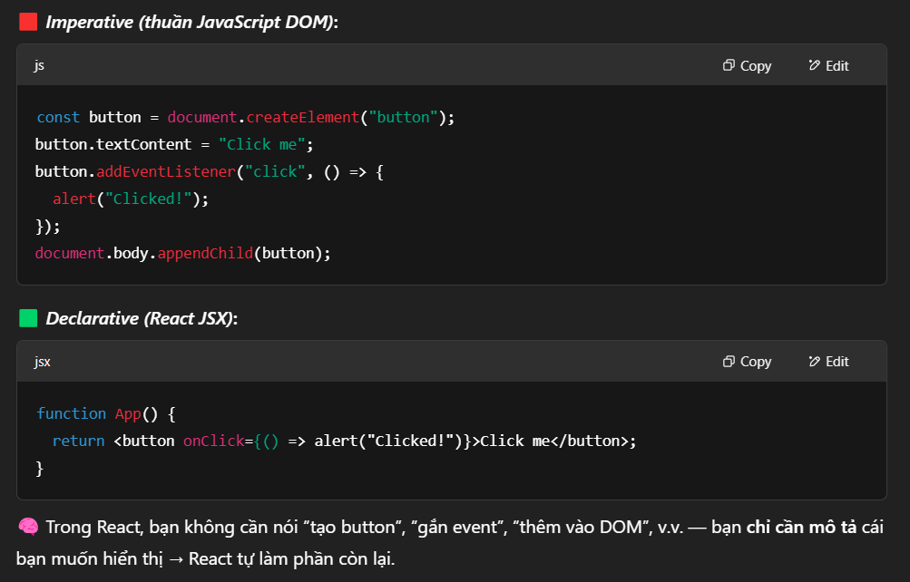
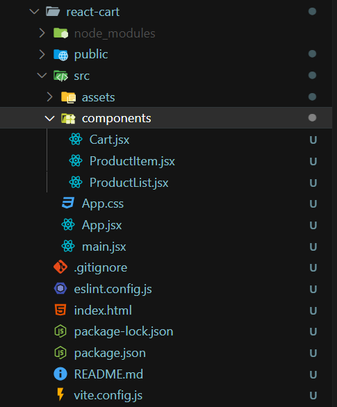
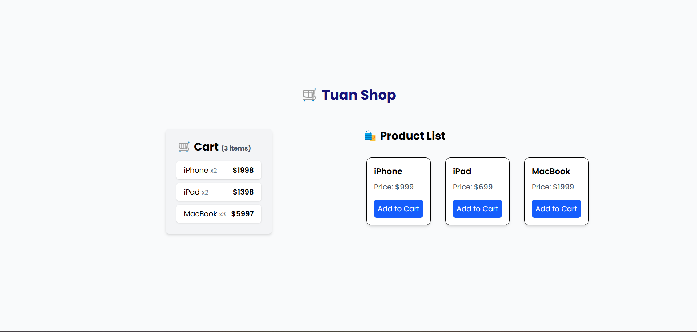

# Giải thích Day5

Nội dung lý thuyết:
- Tổng quan ReactJS
- JSX Syntax
- Functional Component
- Props / Children
- Setup project React
- Code Style Convention

Mini Project: Tạo Product List và Cart đơn giản

---

## Lý thuyết

1. Tổng quan ReactJS

✅ React là gì?
- Là một thư viện JavaScript dùng để xây dựng giao diện người dùng (UI), đặc biệt là cho các ứng dụng Web một trang (Single Page Application - SPA)
- Được phát triển bởi Facebook, React giúp xây dựng UI một cách `component-based` (dựa trên các thành phần nhỏ có thể tái sử dụng).

✅ Tính năng nổi bật:
- Component-based: Xây dựng UI từ các khối nhỏ gọi là component.
- Declarative: Dễ dàng mô tả UI và trạng thái của nó.

- Virtual DOM: Giúp cập nhật giao diện nhanh chóng và hiệu quả.
- Unidirectional Data Flow: Dữ liệu chỉ đi một chiều → dễ kiểm soát.
    - Trong React, dữ liệu luôn chảy từ cha → con thông qua `props`.
    - Con không thể thay đổi trực tiếp dữ liệu từ cha, giúp ứng dụng dễ kiểm soát và debug hơn.

2. JSX Syntax

✅ JSX là gì?
- JSX (JavaScript XML) là cú pháp mở rộng cho phép viết HTML trong JavaScript.
- Ví dụ:
`const element = <h1>Hello, React!</h1>;`

✅ JSX cần lưu ý:
- Trả về **1 element duy nhất**, nếu có nhiều thẻ phải dùng `<> </>` hoặc `<div>`.
- Dùng `className` thay vì `class`.
- Dùng `{}` để nhúng JavaScript vào HTML.

3. Functional Component

✅ Là gì?
- Component dưới dạng hàm JavaScript đơn giản.
```
function Welcome() {
  return <h2>Welcome to React</h2>;
}
```

✅ Ưu điểm:
- Ngắn gọn, dễ hiểu.
- Kết hợp với Hooks để có thể sử dụng state, lifecycle.

4. Props / Children

✅ Props là gì?
- Props (properties) là đối số truyền vào component.
```
function Hello(props) {
  return <h1>Hello, {props.name}</h1>;
}

// Gọi:
<Hello name="Anna" />
```

✅ Children là gì?
- `props.children` là nội dung nằm giữa cặp thẻ của component.
```
function Box(props) {
  return <div className="box">{props.children}</div>;
}

// Gọi:
<Box><p>This is inside the box</p></Box>
```

5. Setup Project React

✅ Dùng Vite (Phổ biến) (Ví dụ dùng cho mini project bên dưới)
```
npm create vite@latest react-card --template react
cd react-card
npm install
npm run dev
```

✅ Hoặc dùng CRA (create-react-app) (Ít dùng)

6. Code Style Convention (Quy chuẩn code)

✅ Quy tắc đặt tên:
- Component: PascalCase → `MyComponent`
- File: `MyComponent.jsx`
- Props: camelCase → `isActive`, `onClick`

✅ Format:
- Dùng Prettier, ESLint để auto-format và bắt lỗi.
- Mỗi component chỉ nên có 1 chức năng chính.
- Sử dụng thư mục `components/`, `pages/`, `assets/` để tổ chức dự án.

## Mini Project - React Cart

## 🚀 How to run:
1. cd `react-cart`
2. `npm i`
3. `npm run dev`

## 🚀 Features

- View a list of products (e.g., iPhone, iPad, MacBook)
- Add products to the cart
- Auto-increase quantity when adding the same product again
- Simple and clean UI with Tailwind CSS

## 📁 Project Structure


## Demo


Click `Add to Cart`:

