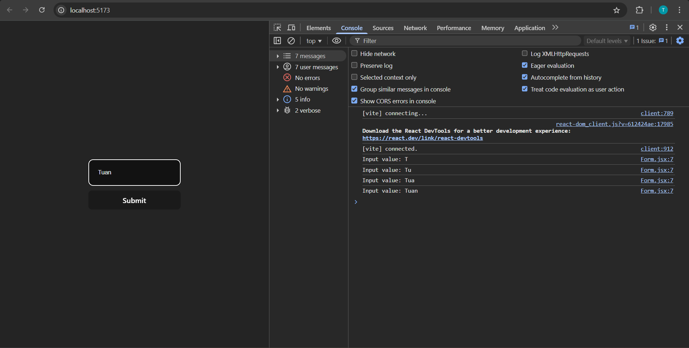
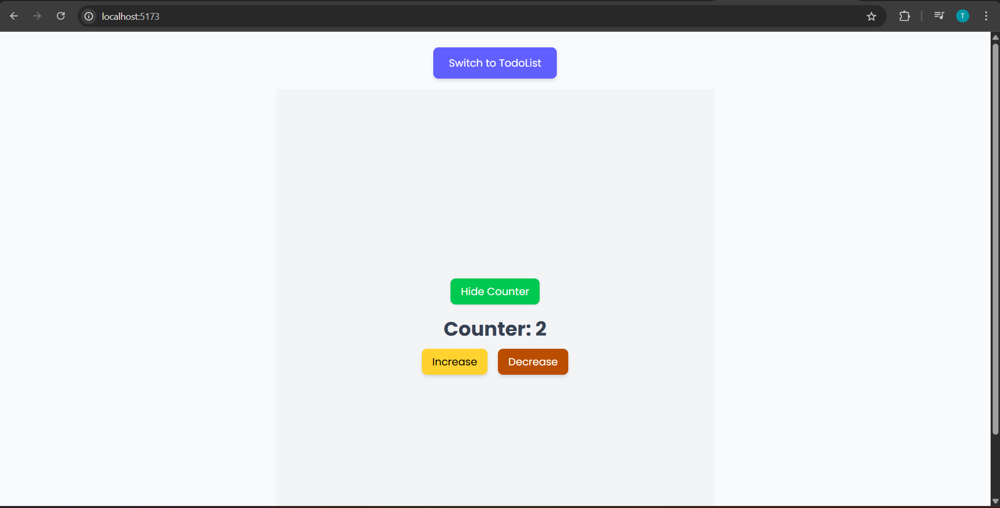
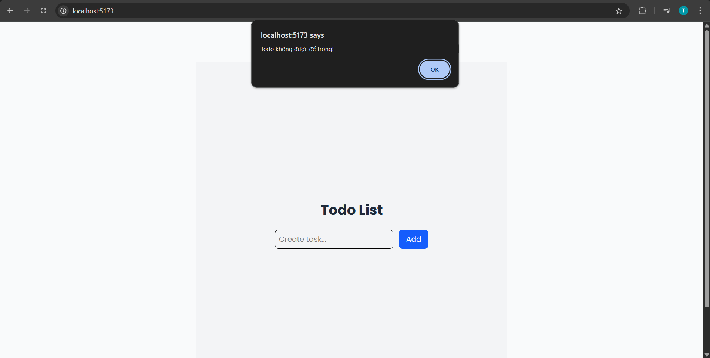
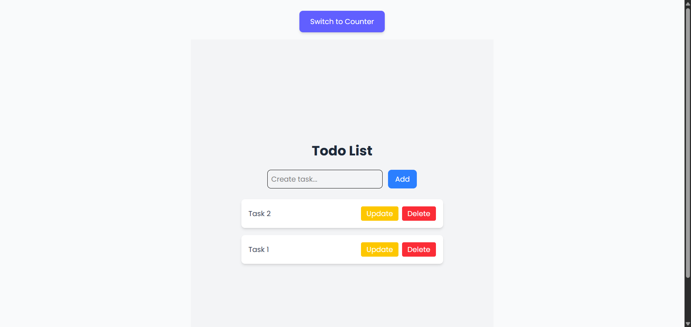
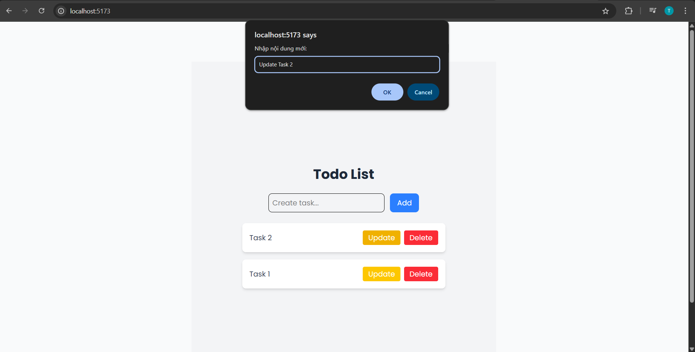
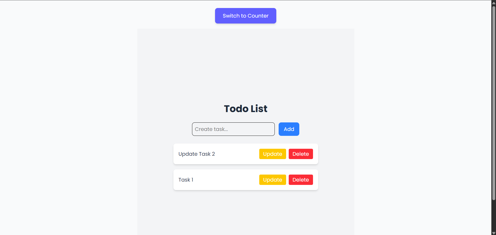
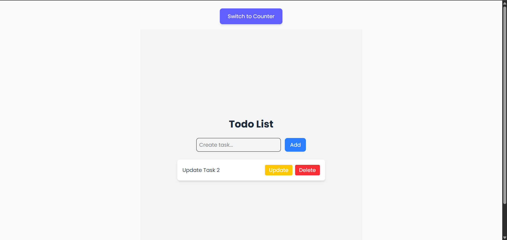
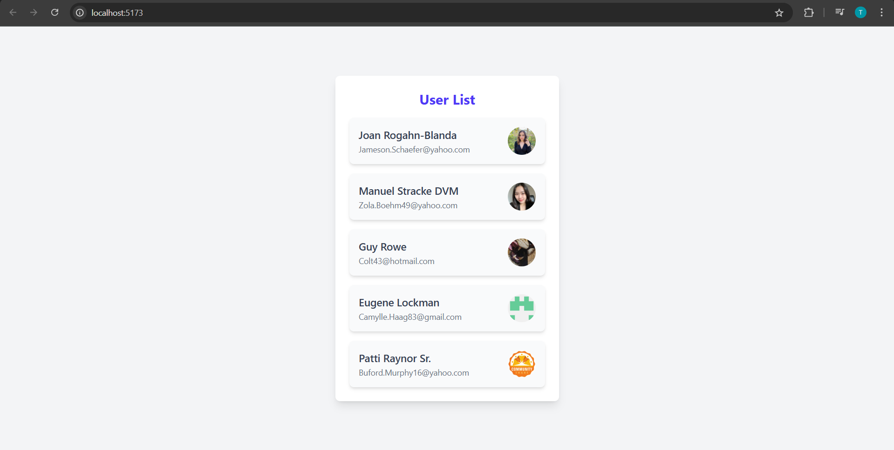

# Giải thích Day6

Nội dung lý thuyết:

- Day 12:
  - useState Hook
  - Event Handling trong React
  - Conditional Rendering
  - Render List, sử dụng key
  - Form input, handle change
- Day 13:
  - useEffect Hook
  - Lifecycle trong Function Component
  - Call API (fetch/axios)

Bài tập:

- Day 12:
  - Làm app Counter: tăng/giảm số khi click + thêm button toggle ẩn/hiện Counter
  - Todo List: Thêm/sửa/xóa todo + validate không cho thêm todo rỗng
- Day 13: Call API public (ví dụ: JSONPlaceholder) + Hiển thị danh sách user

---

## Lý thuyết

### Day 12

1. useState Hook

- `useState` là **hook** dùng để khai báo **state** trong trong một component.
- Syntax:
  `const [state, setState] = useState(initialValue)`
- Khi `setState` được gọi: React sẽ re-render component với giá trị mới
- Ví dụ:

```
import { useState } from "react";

function Counter() {
  const [count, setCount] = useState(0);

  return (
    <div>
      <h1>{count}</h1>
      <button onClick={() => setCount(count + 1)}>Increase</button>
    </div>
  );
}
```

2. Event Handling trong React

- Xử lý sự kiện trong React tương tự như DOM, nhưng:
  - Dùng **camelCase** (`onClick`, `onChange`...) thay vì chữ thường như (`onclick`, `onchange`...)
  - Truyền hàm (không truyền kết quả của hàm)
- Ví dụ:

```
function Button() {
  function handleClick() {
    alert("Button clicked!");
  }

  // Truyền hàm: onClick={handleClick}
  return <button onClick={handleClick}>Click me</button>;
}
```

3. Conditional Rendering

- Render nội dung khác nhau dựa trên điều kiện (Thường xuyên được sử dụng)
- Các cách phổ biến:
  - **if/else**
  - Toán tử **&&**
  - Toán tử **? :**
- Ví dụ 1:

```
{isLoggedIn && <h1>Welcome back!</h1>}
```

- Ví dụ 2:

```
{isLoggedIn ? <h1>Dashboard</h1> : <h1>Please login</h1>}
```

4. Render List, sử dụng key

- Dùng `.map()` để lặp danh sách và render nhiều phần tử.
- Mỗi phần tử cần có một `key` duy nhất để React **tối ưu re-render**.
- Ví dụ:

```
{values.map((value, index) => ( ...Code ))}
```

5. Form input, handle change

- Dùng để quản lý form trong React:
  - Dùng state để lưu giá trị input
  - `onChange để cập nhật giá trị mới vào state`
- Ví dụ (`day-06/practice`):

```
// components/Form.jsx
import { useState } from "react";

function Form() {
  const [name, setName] = useState("");

  function handleChange(event) {
    console.log("Input value:", event.target.value); // Log giá trị khi gõ
    setName(event.target.value);
  }

  function handleSubmit(event) {
    event.preventDefault();
    console.log("Final submitted name:", name); // Log giá trị khi submit
    alert(`Hello, ${name}`);
  }

  return (
    <form style={{display: "flex", flexDirection: "column", gap: "10px"}} onSubmit={handleSubmit}>
        {/* value + onChange */}
      <input
        style={{padding: "20px", borderRadius: "10px"}}
        type="text"
        value={name}
        onChange={handleChange}
        placeholder="Enter your name"
      />
      <button type="submit">Submit</button>
    </form>
  );
}

export default Form;
```

- Kết quả:
  

### Day 13:

1. useEffect Hook

- Là một hook rất quan trọng trong React, giúp bạn quản lý các **side effects** (tác động phụ) trong components. Trước khi `useEffect` ra đời, các side effects chỉ có thể được xử lý trong **class components** thông qua các lifecycle metheds như `componentDidMount`, `componentDidUpdate`, và `componentWillUnmount`
- Cấu trúc cơ bản:

```
useEffect(() => {
  // Code bạn muốn thực thi (side effect) khi component render
}, [dependencies]);
```

- `useEffect(callback, dependencies)`:
  - `callback`: Đây là function mà bạn muốn React thực thi khi component render xong. Thường dùng để xử lý các side effects như: Gọi API, Cập nhật DOM, Quản lý subscription hoặc timers
  - `dependencies`: Đây là mảng các giá trị mà khi thay đổi, `useEffect` sẽ chạy lại. Nếu mảng này rỗng (`[]`), `useEffect` sẽ chỉ chạy khi **component mount** (lần đầu render).

2. Lifecycle trong Function Component
React class components có 3 lifecycle methods chính để xử lý việc `mount`, `update`, và `unmount` của component. Tuy nhiên, với function component sử dụng `useEffect`, bạn có thể **bắt chước** các lifecycle này.

`useEffect` và **Lifecycle Methods**:
- `componentDidMount`: Tương đương với việc useEffect có mảng dependencies rỗng (`[]`). Đây là nơi bạn thực thi logic khi component **lần đầu được render** (mount).
```
useEffect(() => {
  // Code chỉ chạy một lần sau khi component mount
}, []);  // Mảng rỗng để chỉ gọi một lần
```
- `componentDidUpdate`:  Tương đương với việc `useEffect` có dependencies là một mảng giá trị cụ thể. `useEffect` sẽ chạy lại mỗi khi **các giá trị trong dependencies thay đổi**.
```
useEffect(() => {
  // Code chạy mỗi khi `value` thay đổi
}, [value]);
```
- `componentWillUnmount`: Tương đương với việc `useEffect` **trả về một function**, và function này sẽ được gọi khi component unmount (bị gỡ bỏ khỏi DOM). Một trong những tính năng mạnh mẽ của useEffect là khả năng clean-up (dọn dẹp) sau khi component unmount hoặc trước khi effect tiếp theo chạy. Điều này rất hữu ích trong các trường hợp như: Dọn dẹp event listeners, Hủy các API request, Hủy subscriptions (websockets, etc.)
```
useEffect(() => {
  // Code khi component mount

  // Hàm clean-up khi component unmount
  return () => {
    // Clean-up code, ví dụ: hủy bỏ event listeners
  };
}, []);
```

3. Call API (fetch/axios)
Ta có thể gọi API (sử dụng fetch hoặc axios) trong `useEffect`, tùy vào nhu cầu.

- `fetch` là một API của JavaScript để gọi HTTP requests. Đây là API tích hợp sẵn trong hầu hết các trình duyệt hiện đại, vì vậy bạn **không cần cài đặt thư viện bên ngoài**. `fetch` trả về một Promise và bạn phải xử lý kết quả bằng `.then()` hoặc `async/await`.
```
fetch('https://api.example.com/data')
  .then(response => response.json())  // Chuyển phản hồi thành JSON
  .then(data => console.log(data))
  .catch(error => console.error('Error:', error));
```
- `axios` là một thư viện bên ngoài dùng để gửi HTTP requests, bạn cần cài đặt bằng `npm` hoặc `yarn`. `axios` cung cấp nhiều tính năng mạnh mẽ như tự động chuyển đổi response thành JSON và có các tùy chọn cấu hình chi tiết hơn.
```
<!-- Bước 1 -->
npm install axios

<!-- Demo -->
import axios from 'axios';

axios.get('https://api.example.com/data')
  .then(response => console.log(response.data))
  .catch(error => console.error('Error:', error));
```

## Bài tập (Gồm Day12 và Day13)

### Day 12

1. Run dự án

- `cd practice-day12`
- `npm i`
- `npm run dev`

2. Cấu trúc dự án

- Dự án có sử dụng `TailwindCSS`
- `components` gồm:
  - `Counter.jsx`
  - `Form.jsx` (Demo phần lý thuyết)
  - `TodoList.jsx`

3. Demo dự án

`Counter.jsx`


`TodoList.tsx`

- Validate khi nhập chuỗi rỗng:
  

- Thêm Task (task sau ở trên):
  

- Update Task:
  

- Update thành công:
  

- Xoá Task:
  

### Day 13
1. Run dự án

- `cd practice-day12`
- `npm i`
- `npm run dev`

2. Mô tả dự án

- Dự án có sử dụng `TailwindCSS`
- API sử dụng của `MockAPI`

3. Demo dự án:
