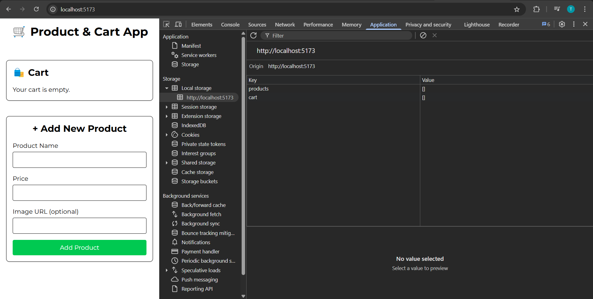
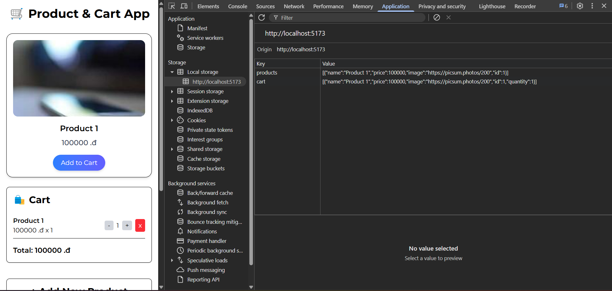

# 🛒 Product & Cart Management App

Mini project `ReactJS` kết hợp `TailwindCSS` giúp quản lý sản phẩm và giỏ hàng.  
Bạn có thể thêm sản phẩm, cho sản phẩm vào giỏ, chỉnh sửa số lượng sản phẩm, và lưu trữ dữ liệu bằng `localStorage`.

## ✨ Chức năng

- Hiển thị danh sách sản phẩm (ảnh, tên, giá)
- Thêm sản phẩm vào giỏ hàng
- Hiển thị danh sách giỏ hàng:
  - Xem tên sản phẩm, số lượng, tổng tiền
  - Cập nhật số lượng
  - Xóa sản phẩm khỏi giỏ hàng
- Form thêm sản phẩm mới:
  - Validate tên và giá (không được để trống)
- Lưu trữ dữ liệu trên `localStorage`, khi reload lại trang thì giỏ hàng vẫn được lưu trữ từ phiên làm việc trước đó

## 🛠 Công nghệ sử dụng

- [ReactJS](https://reactjs.org/) — Xây dựng UI
- [TailwindCSS](https://tailwindcss.com/) — Thiết kế giao diện đẹp nhanh chóng
- `localStorage` — Lưu trữ dữ liệu phía client

## Giao diện chính

- **Trang sản phẩm:**  
  Hiển thị sản phẩm dưới dạng thẻ với ảnh, tên, giá và nút "Add to Cart".

- **Giỏ hàng:**  
  Hiển thị các sản phẩm đã chọn, có thể tăng/giảm số lượng hoặc xóa.

- **Form thêm sản phẩm:**  
  Thêm sản phẩm mới vào danh sách và hiển thị ngay lập tức.

## 🚀 Cách chạy dự án

1. `cd product-cart-app`
2. `npm i`
3. `npm run dev`

## Demo dự án

1. Đầu tiên thêm sản phẩm

2. Sản phẩm và giỏ hàng đều được lưu trữ trong `localStorage`
