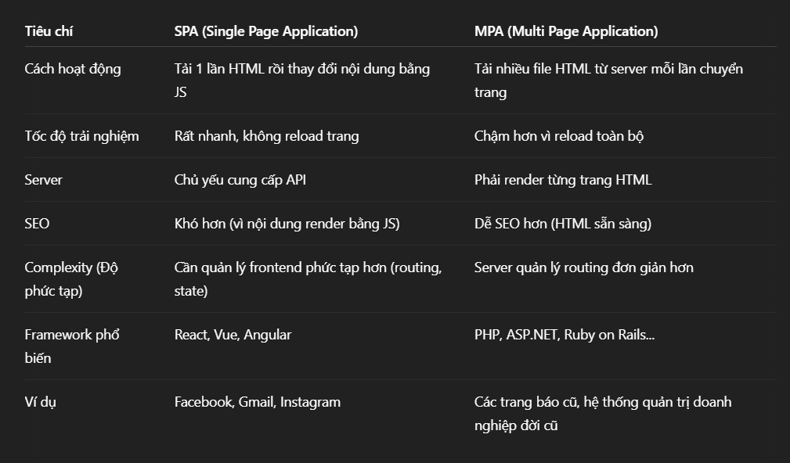
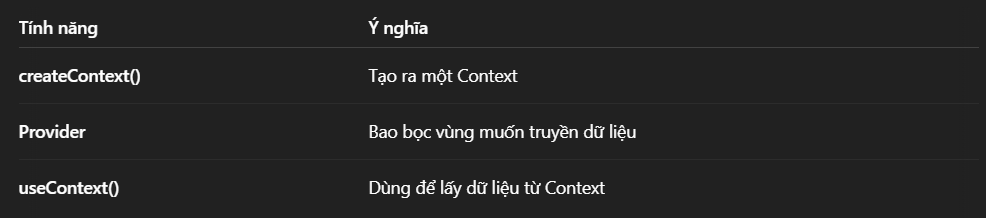
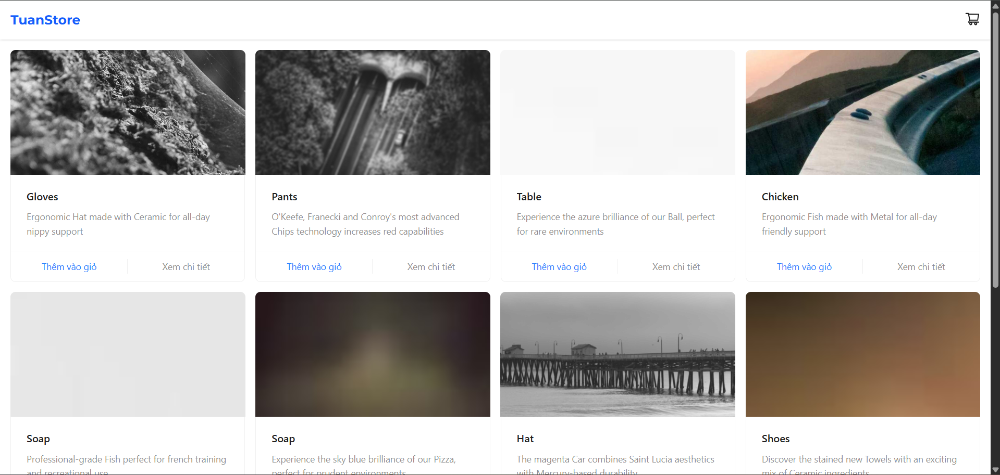
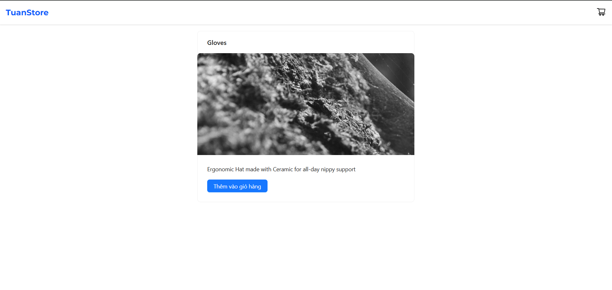
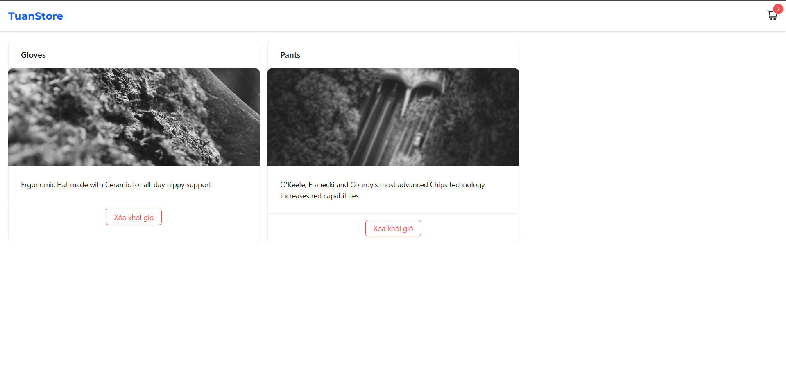
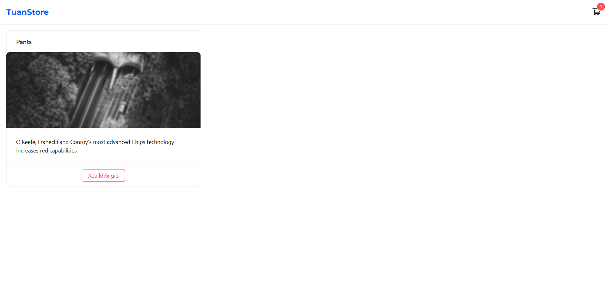

# Giải thích Day6

Nội dung lý thuyết:
- Giới thiệu SPA, Router dom v6
- Nested Routes, Dynamic Route
- Context API - Global State

Bài tập:
- Xây dựng app quản lý sản phẩm có các trang: home, product detail (router param), context quản lý cart (add/remove)

---

## Lý thuyết

1. SPA, Router DOM v6
- **SPA (Single Page Application)**:
    - Là một ứng dụng web chỉ tải duy nhất một file HTML ban đầu
    - Khi người dùng điều hướng giữa các trang, SPA **không tải lại toàn bộ trang mà chỉ cập nhật nội dung** bằng JavaScript.
    - Ví dụ: Giả sử bạn vào website Facebook. Khi bạn click vào Profile, Messages, Notifications,... thì chỉ một phần nội dung trang thay đổi (ví dụ: khung nội dung chính), còn menu, header, sidebar vẫn giữ nguyên.
    - Bảng so sánh giữa SPA Và MPA (Multi Page Application):
     
- **React Router DOM v6**:
    - Thư viện dùng để điều hướng (routing) trong React
    - Cho phép xây dựng nhiều trang (route) khác nhau và điều hướng chúng mà không **reload**.
    - V6 có nhiều thay đổi so với v5 như:
        - Các thành phần `Switch` được thay bằng `Routes`.
        - Cú pháp tối giản, dễ đọc hơn.
        - Nested routing mạnh mẽ hơn.
    - Ví dụ:
```
import { BrowserRouter, Routes, Route } from "react-router-dom";

function App() {
  return (
    <BrowserRouter>
      <Routes>
        <Route path="/" element={<Home />} />
        <Route path="/about" element={<About />} />
      </Routes>
    </BrowserRouter>
  );
}
```

2. Nested Routes và Dynamic Route
- **Nested Routes (Tuyến lồng nhau)**:
    - Là khi một trang (route) chứa nhiều route con bên tron
    - Dùng để quản lý giao diện có bố cục chung (ví dụ: Navbar, Footer).
    - Các Route con cần có `<Outlet />` để render đúng vị trí.
    - Ví dụ: Khi vào `/dashboard/analytics` => hiển thị `Dashboard` + `Analytics`.
```
import { BrowserRouter, Routes, Route, Outlet } from "react-router-dom";

function Dashboard() {
  return (
    <div>
      <h1>Dashboard</h1>
      <Outlet /> {/* Render route con ở đây */}
    </div>
  );
}

function Analytics() {
  return <h2>Analytics</h2>;
}

function Settings() {
  return <h2>Settings</h2>;
}

function App() {
  return (
    <BrowserRouter>
      <Routes>
        <Route path="/dashboard" element={<Dashboard />}>
          <Route path="analytics" element={<Analytics />} />
          <Route path="settings" element={<Settings />} />
        </Route>
      </Routes>
    </BrowserRouter>
  );
}
```
- **Dynamic Route (Tuyến động)**:
    - Là các route có tham số động, không cố định.
    - Thường dùng để hiển thị chi tiết bài viết, sản phẩm, user profile...
    - Ví dụ:
```
import { useParams } from "react-router-dom";

function ProductDetail() {
  const { productId } = useParams();
  return <h1>Product ID: {productId}</h1>;
}

function App() {
  return (
    <BrowserRouter>
      <Routes>
        <Route path="/product/:productId" element={<ProductDetail />} />
      </Routes>
    </BrowserRouter>
  );
}
```

3. Context API - Global State

**Context API là gì?**
- **Context API** cho phép truyền dữ liệu từ cấp cao nhất xuống các component con mà **không cần props chaining** (không phải truyền qua nhiều cấp props).
- Dùng để quản lý state chung cho toàn ứng dụng, hay cho nhiều component cần chung dữ liệu.
- Một dạng **Global State** gọn nhẹ, có sẵn trong React (không cần thư viện ngoài như Redux).

**Các bước sử dụng ContextAPI**:
(1) Tạo Context
```
import { createContext } from "react";

export const UserContext = createContext(null);
```

(2) Cung cấp Context (Provider): `value` là dữ liệu muốn chia sẻ toàn app
```
import { UserContext } from "./UserContext";

function App() {
  const user = { name: "John", age: 30 };

  return (
    <UserContext.Provider value={user}>
      <Dashboard />
    </UserContext.Provider>
  );
}
```

(3) Sử dụng Context trong component con
```
import { useContext } from "react";
import { UserContext } from "./UserContext";

function Dashboard() {
  const user = useContext(UserContext);
  return <h1>Welcome {user.name}</h1>;
}
```

**Tóm tắt**:


## Mini Project: Product Management + Shopping Cart (React + AntD + Tailwind)

### 🚀 Mô tả

Đây là một mini project xây dựng bằng **React**, sử dụng các công nghệ sau:

- **React Router v6**
- **Context API**
- **Ant Design**
- **Tailwind CSS**
- **Axios**
- **mockAPI**

### 📦 Tính năng chính

- ✅ Trang Home: hiển thị danh sách sản phẩm từ API.
- ✅ Trang Product Detail: xem thông tin chi tiết sản phẩm (dùng `router param`).
- ✅ Context quản lý giỏ hàng: thêm / xoá sản phẩm.
- ✅ UI thân thiện: sử dụng Ant Design + Tailwind CSS.
- ✅ Route động, route lồng nhau.

### 🔗 API sử dụng

Dữ liệu sản phẩm được lấy từ API mock: `https://680efc6867c5abddd1937a89.mockapi.io/api/v1/products`

### 🧩 Cấu trúc thư mục chính
```
src/
├── components/
│   └── Header.jsx
├── context/
│   ├── CartContext.jsx
│   └── useCart.js
├── data.js
├── pages/
│   ├── Home.jsx
│   ├── ProductDetail.jsx
│   └── CartPage.jsx
├── App.jsx
└── main.jsx
```

### ▶️ Cách chạy project
```
# Cài đặt dependencies
npm install

# Chạy development server
npm run dev
```

### 📸 Demo UI

1. Trang Home:


2. Product Detail:


3. Cart Detail:


4. Xoá sản phẩm khỏi giỏ hàng:
