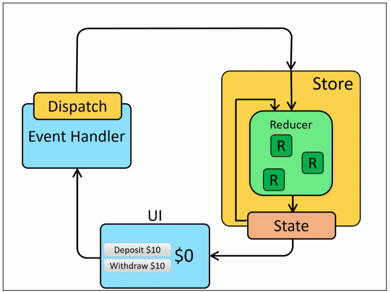

# Giải thích Day9

Nội dung lý thuyết:
- Phân biệt `useReducer` vs `useState`

Bài tập - Refactor Cart App:
- Refactor Context dùng `useReducer`
- Thêm Reducer quản lý cart
- Custom hook cho logic add/remove
- Kết nối API NodeJS Products, làm CRUD đầy đủ trên React

## Lý thuyết: Phân biệt giữa `useReducer` vs `useState`

Đều là hook trong React **dùng để quản lý state**, nhưng mỗi cái có cách hoạt động và mục đích sử dụng khác nhau.

1. Mục đích sử dụng

- `useState`: Khi state đơn giản, ít logic cập nhật. Code dễ đọc và ngắn
- `useReducer`: Khi state phức tạp, nhiều hành động cập nhật. Code tốt hơn khi chia tách logic cập nhật qua reducer

2. Cách sử dụng cơ bản: Ví dụ quản lý một biến đếm `count` có thể **tăng** hoặc **giảm**

`useState`:
```
// Đơn giản và dễ hiểu
const [count, setCount] = useState(0);

const increment = () => setCount(prev => prev + 1);
```

`useReducer`:
```
// 1. Khởi tạo initialState, useReducer sẽ dùng giá trị này làm state gốc ban đầu
const initialState = { count: 0 };

// 2. Định nghĩa hàm reducer: state hiện tại, action được gửi đến (dispatch)
function reducer(state, action) {
  switch (action.type) {
    case 'increment':
      return { count: state.count + 1 };
    case 'decrement':
      return { count: state.count - 1 };
    default:
      return state;
  }
}

// 3. Sử dụng useReducer: state: là object { count: ... }, dispatch: là hàm dùng để gửi action đến reducer
const [state, dispatch] = useReducer(reducer, initialState); 

// 4. Định nghĩa hàm increment
const increment = () => dispatch({ type: 'increment' });

// 5. Tương tự, có thể viết:
const decrement = () => dispatch({ type: 'decrement' });
```

3. Minh hoạ workflow:


## Bài tập:

1. Refactor Context dùng `useReducer` + Custom hook cho logic add/remove

Code ban đầu (sử dụng `useState`):
```
// CartContext.jsx
import { useState } from "react";
import { CartContext } from "./useCart";

export const CartProvider = ({ children }) => {
  const [cart, setCart] = useState([]);

  const addToCart = (product) => {
    setCart((prev) => [...prev, product]);
  };

  const removeFromCart = (id) => {
    setCart((prev) => prev.filter((item, index) => item.id !== id || index !== prev.findIndex(p => p.id === id)));
  };

  return (
    <CartContext.Provider value={{ cart, addToCart, removeFromCart }}>
      {children}
    </CartContext.Provider>
  );
};

// useCart.js
import { createContext, useContext } from "react";

export const CartContext = createContext();

export const useCart = () => useContext(CartContext);
```

Code sau khi đã Refactor (sử dụng `useReducer`):
```
// 1. Bổ sung thêm file cartReducer.js
export const initialCartState = [];

export function cartReducer(state, action) {
  switch (action.type) {
    case "ADD_TO_CART":
      return [...state, action.payload];

    case "REMOVE_FROM_CART": {
      const indexToRemove = state.findIndex(
        (item) => item.id === action.payload
      );
      if (indexToRemove === -1) return state;
      return [
        ...state.slice(0, indexToRemove),
        ...state.slice(indexToRemove + 1),
      ];
    }

    default:
      return state;
  }
}

// 2. Sửa đổi file CartContext.jsx
import { useReducer } from "react";
import { CartContext } from "./useCart";
import { cartReducer, initialCartState } from "./cartReducer";

export const CartProvider = ({ children }) => {
  const [cart, dispatch] = useReducer(cartReducer, initialCartState);

  const addToCart = (product) => {
    dispatch({ type: "ADD_TO_CART", payload: product });
  };

  const removeFromCart = (id) => {
    dispatch({ type: "REMOVE_FROM_CART", payload: id });
  };

  return (
    <CartContext.Provider value={{ cart, addToCart, removeFromCart }}>
      {children}
    </CartContext.Provider>
  );
};
```