# Giới thiệu Shopify và Shopify App Development

Nội dung chính:
- Shopify là gì? Mô hình hoạt động
- Các loại Shopify App (Public, Private, Custom)
- Shopify Partner, Dev Store, Shopify App Store
- Các khái niệm bổ sung (Tự học)

Bài tập:
- Đăng ký Shopify Partner Account
- Tạo Dev Store đầu tiên
- Khám phá Admin Dashboard và các tính năng
- Cài thử 1 public app vào store test

## Lý thuyết

### 1. Shopify là gì? Mô hình hoạt đông

**Shopify** là một nền tảng **SaaS (Software as a Service)** giúp cá nhân và doanh nghiệp tạo lập, quản lý và vận hành một cửa hàng trực tuyến mà không cần biết lập trình.

**Mô hình hoạt động của Shopify:**
- Người bán (merchants) đăng ký và tạo cửa hàng.
- Hệ thống cung cấp hosting, bảo mật, giao diện, quản lý đơn hàng, sản phẩm, thanh toán, v.v.
- Người dùng có thể tùy chỉnh bằng cách cài Shopify Apps và chỉnh sửa theme.

### 2. Các loại Shopify App (Public, Private, Custom)

| Loại App               | Mô tả                                                                            | Dùng khi nào                                   |
| ---------------------- | -------------------------------------------------------------------------------- | ---------------------------------------------- |
| **Public App**         | Công khai trên **Shopify App Store**, ai cũng có thể cài. Cần review từ Shopify. | Khi bạn muốn bán app cho nhiều cửa hàng.       |
| **Custom App**         | Cài riêng cho 1 cửa hàng, không cần thông qua App Store.                         | Khi bạn làm app theo yêu cầu cho 1 khách hàng. |
| **Private App** *(cũ)* | Giống Custom App nhưng đã bị Shopify loại bỏ.                                    | Không dùng nữa – nên chuyển sang Custom App.   |

### 3. Shopify Partner, Dev Store, Shopify App Store

- **Shopify Partner**: Tài khoản dành cho **dev** hoặc **agency** phát triển app, theme hoặc làm store cho khách
- **Dev Store**:  Cửa hàng miễn phí dùng để phát triển, test theme hoặc app → Tạo được từ dashboard Partner
- **Shopify App Store**: Shopify App Store: Nơi các Public App được list và người bán có thể tìm kiếm, cài đặt vào store

### Các khái niệm bổ sung

1. **Theme** (giao diện)
- Theme là giao diện của cửa hàng Shopify.
- Mỗi theme bao gồm các file `Liquid` (template engine của Shopify), CSS, JavaScript và asset khác.
- Người dùng có thể:
    - Chọn theme có sẵn từ **Shopify Theme Store**
    - Tùy chỉnh trực tiếp qua **Theme Editor** hoặc chỉnh code (Liquid)
    - Dùng theme miễn phí hoặc theme trả phí

🔧 *Lập trình viên có thể phát triển theme riêng để dùng hoặc bán cho khách hàng.*

2. **Ví dụ một Shopify App nổi bật: App “Klaviyo: Email Marketing & SMS” và cách nó hoạt động:**
- Loại App: Public App
- Công dụng:
    - Thu thập email và SMS của khách hàng
    - Tự động gửi email chào mừng, khuyến mãi, giỏ hàng bị bỏ rơi...
    - Theo dõi hành vi mua hàng để cá nhân hóa nội dung

💡 Cách hoạt động của Klaviyo:
- Cài đặt từ Shopify App Store
- OAuth ủy quyền → App có quyền đọc danh sách khách hàng, đơn hàng...
- App chèn snippet JavaScript vào theme để theo dõi hành vi người dùng
-  liệu đồng bộ với Klaviyo backend → xử lý segment khách hàng
- Người dùng tạo flow automation trên Klaviyo dashboard

## Bài tập

### 1. Đăng ký Shopify Partner Account

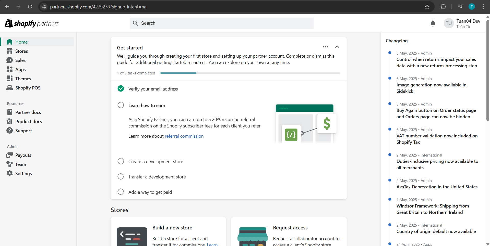

### 2. Tạo Dev Store đầu tiên

Store: `tuan-dev-store`

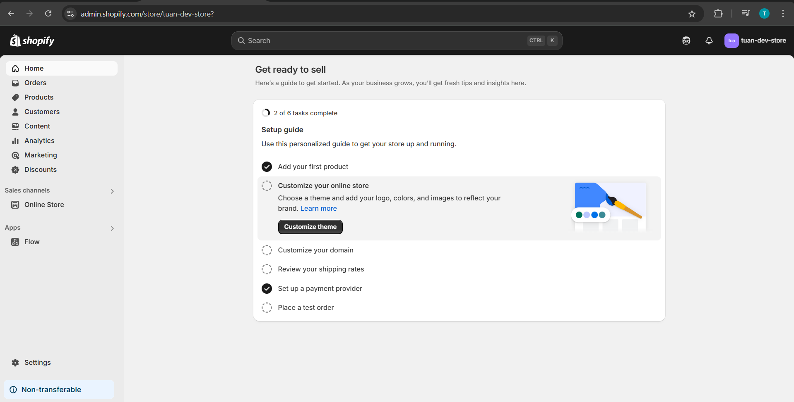

### 3. Khám phá Admin Dashboard và các tính năng

- **Home**: Trang tổng quan, hiển thị checklist giúp ta từng bước hoàn thiện store

- **Orders**: Quản lý đơn hàng của khách hàng (Drafts, Shipping labels, Abandoned checkouts)
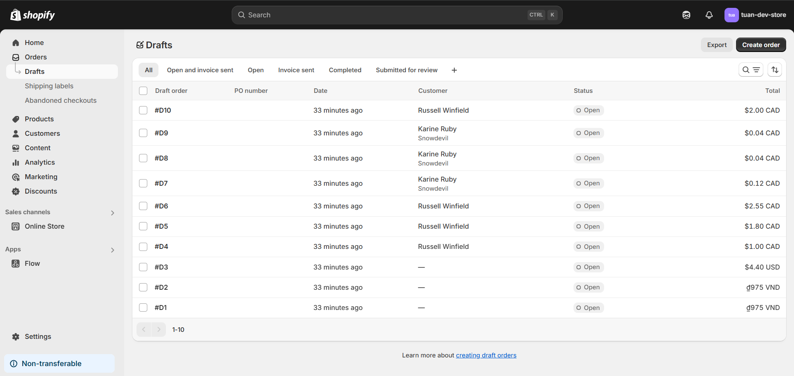
- **Products**: Quản lý toàn bộ sản phẩm: thêm sản phẩm, chỉnh sửa, quản lý kho, biến thể (variant), hình ảnh...
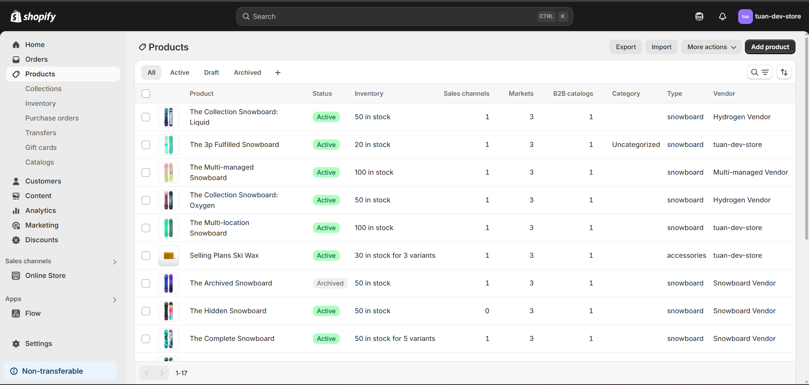
- **Customer**: Danh sách khách hàng đã mua hàng, tạo tài khoản hoặc đăng ký email.
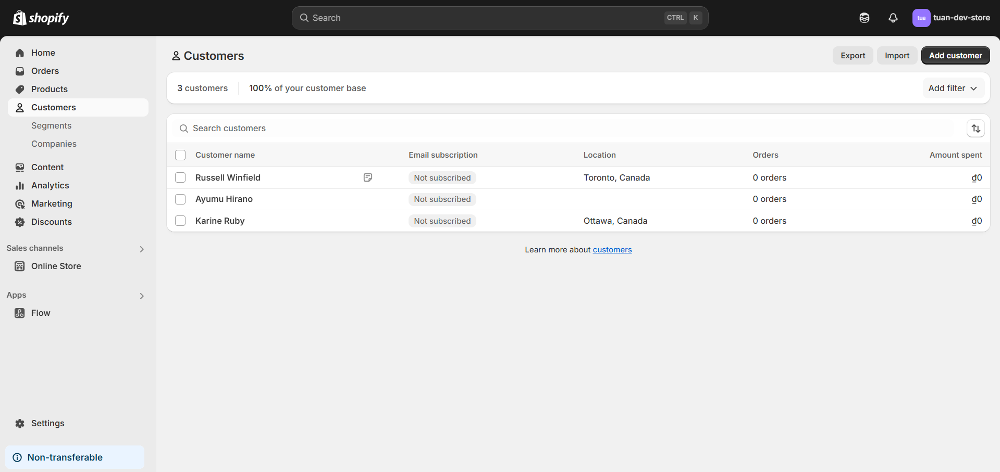
- **Content**: Quản lý các nội dung như (Metaobjects, Files, Menus, Blog posts)
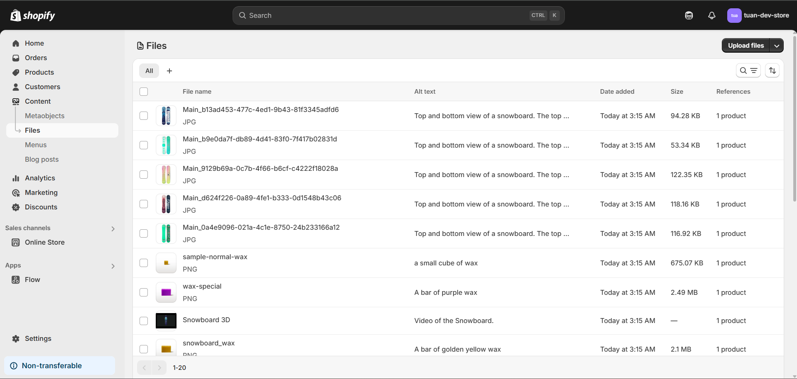
- **Analytics**: Báo cáo hiệu suất bán hàng, doanh thu, tỷ lệ chuyển đổi, v.v.
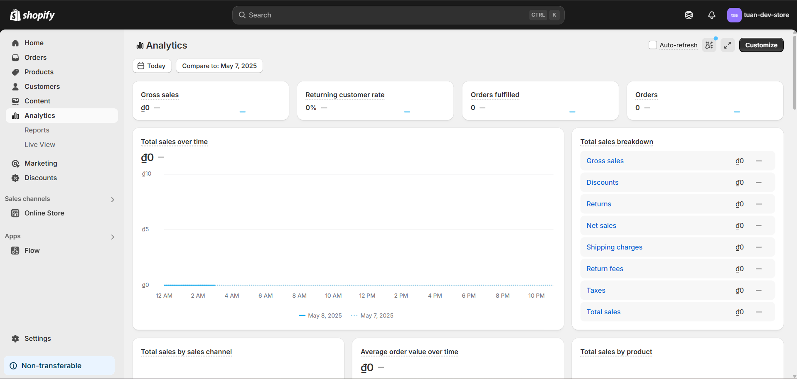
- **Marketing**: Tạo chiến dịch email, quảng cáo Facebook/Google hoặc tự động hóa tiếp thị.
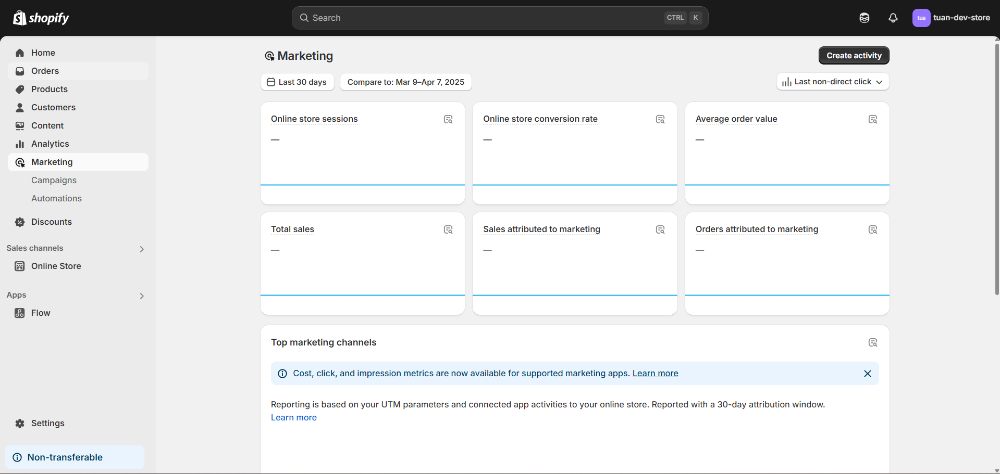
- **Discounts**: Tạo mã giảm giá, chương trình khuyến mãi theo giá trị, phần trăm, freeship, v.v.
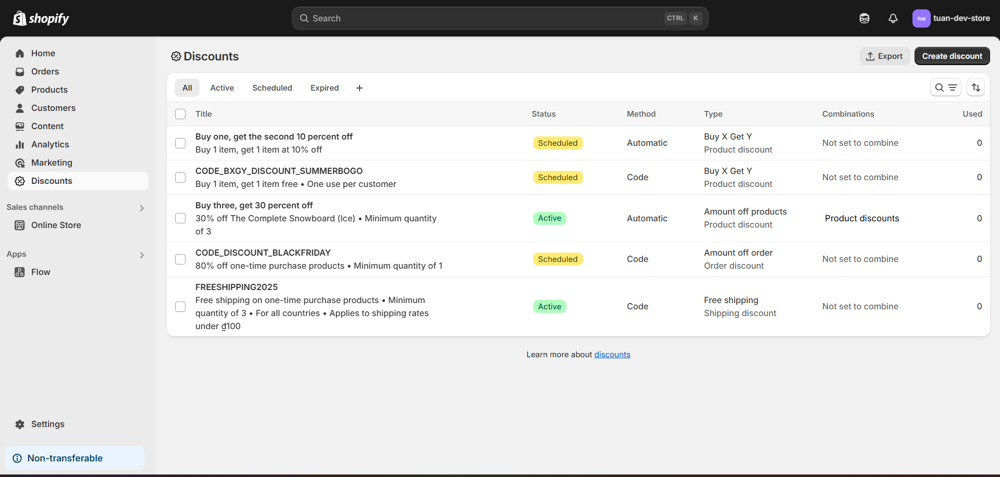
- **Online Store** trong **Sales Channels**: Tùy chỉnh giao diện (theme), điều hướng menu, tên miền, v.v. Đây là nơi để bạn thiết kế và xuất bản website bán hàng.
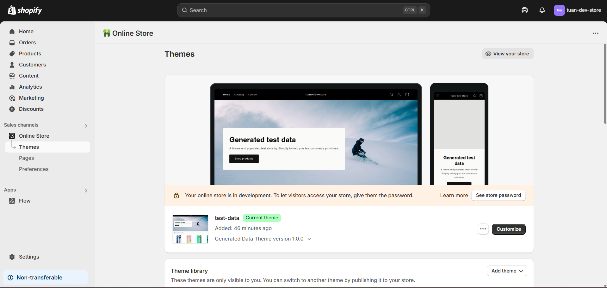
- **Apps**: Danh sách các app bạn đã cài vào store. App giúp mở rộng tính năng của Shopify như in hóa đơn, kết nối vận chuyển, chatbot...

- **Settings**: Nơi cấu hình mọi thứ: thanh toán, vận chuyển, thuế, domain, email, chính sách, developer settings v.v.

### 4. Cài thử 1 public app vào store test

Đã cài thành công app `Google & YouTube` vào store `tuan-dev-store`

`Google & YouTube` App làm gì?
- Cho phép kết nối Shopify Store với tài khoản Google Merchant Center và Google Ads.
- Tự động đồng bộ sản phẩm lên Google để chạy quảng cáo, hiển thị trên Google Shopping, YouTube Shopping…
- Hỗ trợ tracking chuyển đổi (conversion) từ Google Ads.

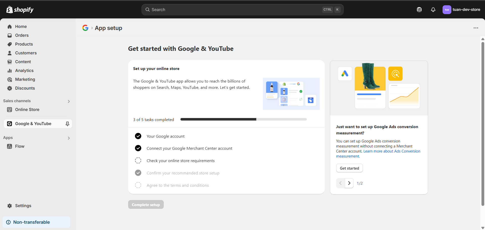