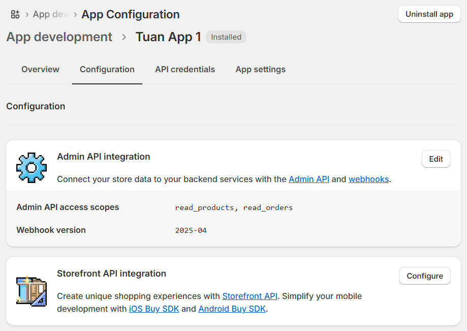
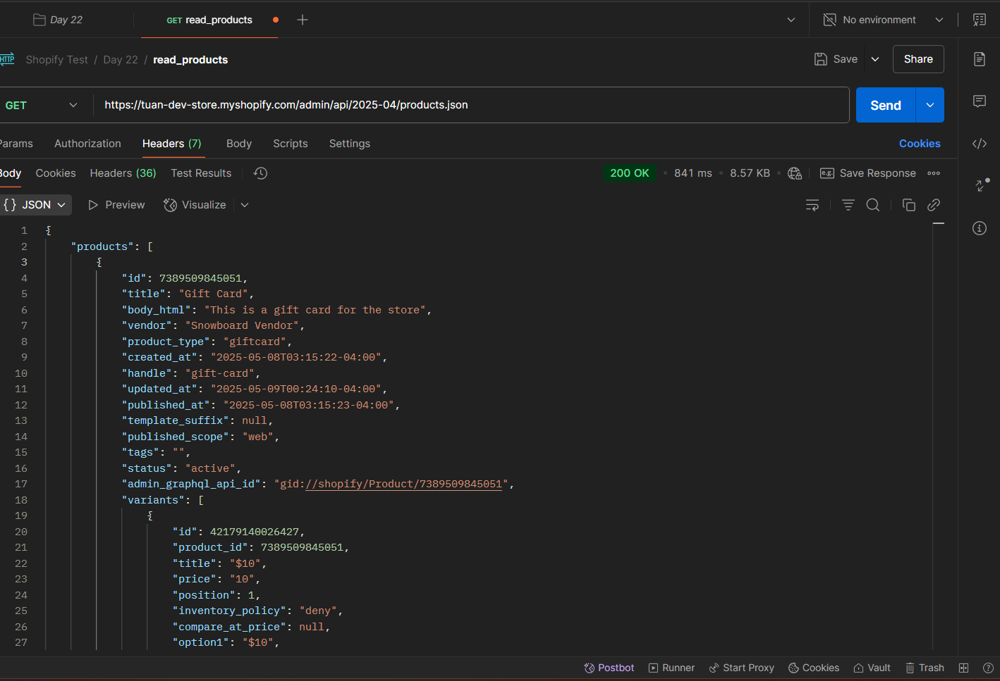
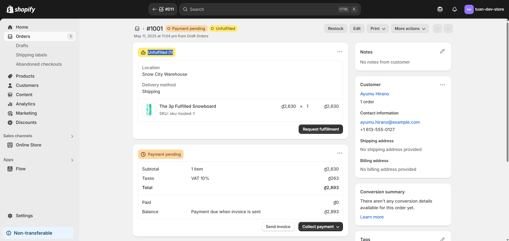
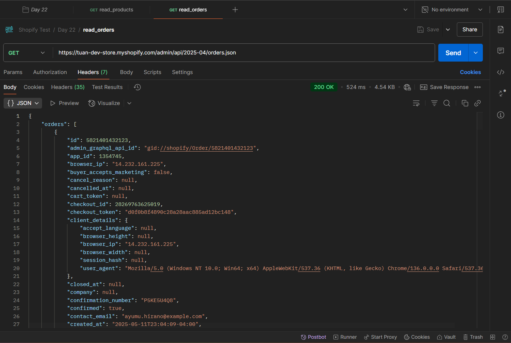
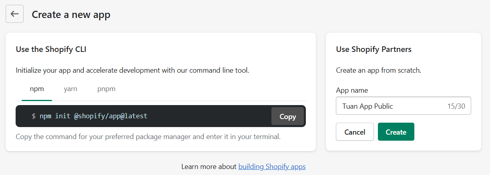
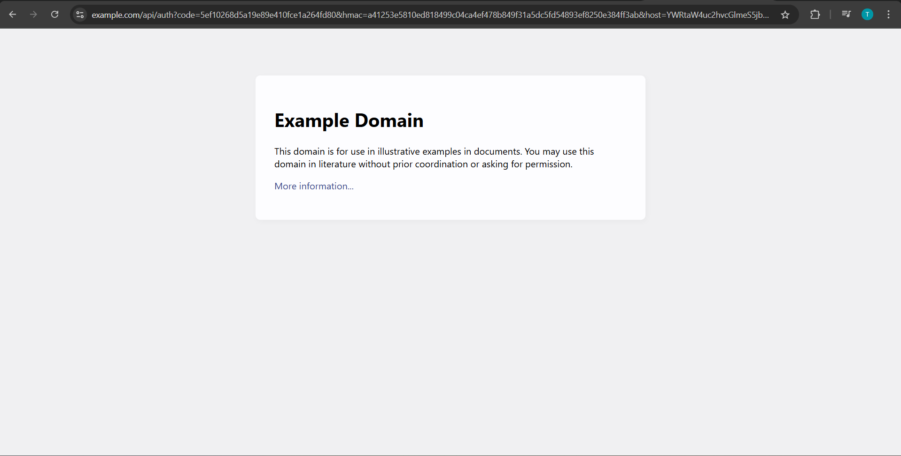
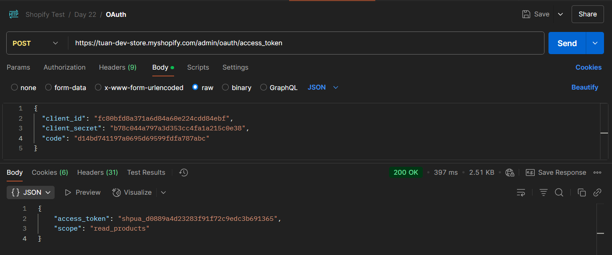
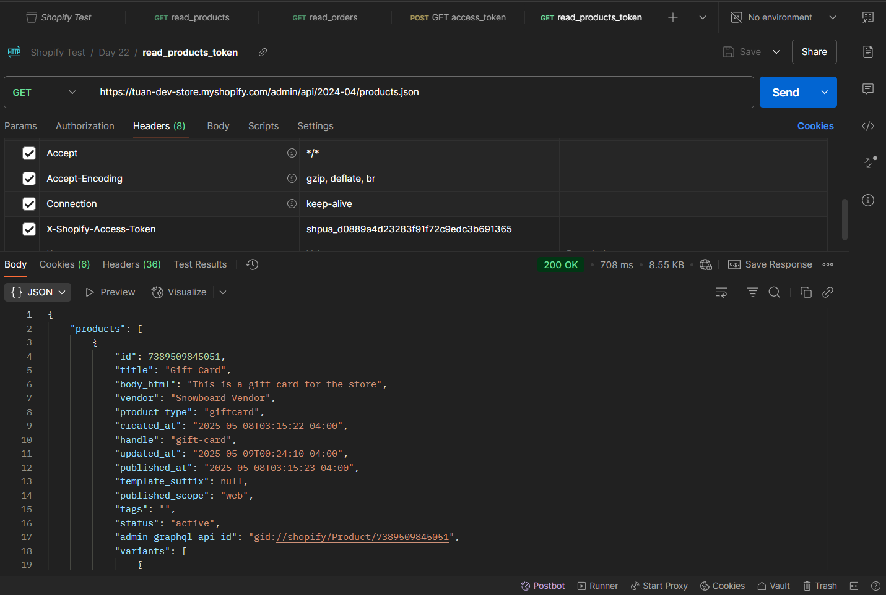

# Shopify API Overview (Rest - GraphQL)

**Nội dung chính: `REST API` vs `GraphQL`**

- Giới thiệu các API quan trọng: Product API, Customer API, Order API
- Tìm hiểu các API mà Shopify cung cấp cho App
- Nắm được **các giới hạn (rate limit, scope)** khi gọi API
- Phân tích REST API vs GraphQL API
- Hiểu về Rate Limit và tính toán limit
- Phân quyền scope, xin đúng quyền API
- Các lỗi thực tế khi phát triển app:
  - Vượt limit
  - Thiếu scope
  - Lỗi API khi thiếu dữ liệu
  - Xử lý lỗi và retry logic
- Hiểu OAuth flow cơ bản để lấy access token
- Giới thiệu Postman test Shopify API

**Bài tập**:

- Test API trên Postman:
  - Lấy danh sách products
  - Lấy thông tin 1 product
- Tìm hiểu OAuth Flow để hiểu cơ chế token

---

## Lý thuyết

### 1. So sánh giữa `REST API` và `GraphQL`

| Đặc điểm         | REST API                       | GraphQL API                               |
| ---------------- | ------------------------------ | ----------------------------------------- |
| Cách hoạt động   | Endpoint theo resource         | Một endpoint duy nhất                     |
| Cấu trúc dữ liệu | Đầy đủ, có thể dư dữ liệu      | Chỉ lấy dữ liệu cần thiết                 |
| Số lượng request | Có thể cần nhiều               | Giảm số request (do lấy nhiều data 1 lần) |
| Học và dùng      | Dễ dùng, phổ biến hơn          | Cần học cú pháp GraphQL                   |
| Hiệu suất        | Có thể kém hơn với UI phức tạp | Tốt hơn trong mobile & SPA apps           |

### 2. Các API quan trọng trong Shopify

📌 `Edges` và `node`?

- `Edges`: Mỗi phần tử của danh sách, giống như **dòng dữ liệu**
- `node`: Dữ liệu thực tế của item đó (sản phẩm, đơn hàng..)

Shopify (hay GraphQL) nói chung sử dụng **Relay-style pagination giúp**:

- Hỗ trợ phân trang linh hoạt
- Giảm lỗi khi duyệt nhiều dữ liệu

**1. Product API**

- Truy cập danh sách, tạo, sửa, xoá sản phẩm
- REST: `GET /admin/api/2023-10/products.json`
- GraphQL:

```
{
  products(first: 10) {
    edges {
      node {
        id
        title
        variants(first: 1) {
          edges {
            node {
              price
            }
          }
        }
      }
    }
  }
}
```

Giải thích:

- `2023-10`: là **API version**, `YYYY-MM`(năm-tháng)
- Lấy 10 sản phẩm đầu tiên trong danh sách
- `edges`: GraphQL trả kết quả theo dạng **Connection (có phân trang)**.
- Mỗi `edge` chứa một `node`, tức là 1 đối tượng sản phẩm cụ thể
- `ariants(first: 1)`: Lấy biến thể đầu tiên của sản phẩm (1 sản phẩm có thể có nhiều biến thể), và lấy `price` của biến thể đầu tiên

**2. Customer API**

- Quản lý thông tin khách hàng
- REST: `GET /admin/api/2023-10/customers.json`
- GraphQL:

```
{
  customers(first: 5) {
    edges {
      node {
        id
        email
        firstName
        lastName
      }
    }
  }
}
```

**3. Order API**

- Quản lý đơn hàng, trạng thái, sản phẩm trong đơn.
- REST: `GET /admin/api/2023-10/orders.json`
- GraphQL:

```
{
  orders(first: 5) {
    edges {
      node {
        name
        totalPriceSet {
          shopMoney {
            amount
            currencyCode
          }
        }
      }
    }
  }
}
```

Mục tiêu lấy **5 đơn hàng đầu tiên**:

- `name`: tên đơn hàng (ví dụ: #1001)
- `totalPriceSet`: tổng tiền đơn hàng
- `shopMoney`: phần thể hiện số tiền tính theo đơn vị tiền tệ của cửa hàng
  - `amount`: số tiền
  - `currencyCode`: mã tiền tệ (VD: USD, VND)

### 3. Các API Shopify cung cấp cho App

| API loại           | Mục đích sử dụng                                                |
| ------------------ | --------------------------------------------------------------- |
| **Admin API**      | Dùng cho app backend, truy xuất store data (REST/GraphQL)       |
| **Storefront API** | Tạo giao diện front-end tùy chỉnh, dùng public API              |
| **Checkout API**   | Quản lý quá trình thanh toán                                    |
| **Billing API**    | Quản lý gói đăng ký/trả phí app                                 |
| **Webhook API**    | Nhận sự kiện thời gian thực (order created, app uninstalled...) |

### 4. Rate Limit: Giới hạn gọi API

Rate limit là **giới hạn số lượng request** mà app có thể gửi đến Shopify trong một khoảng thời gian nhất định (tránh spam, đảm bảo công bằng giữa các app)

Shopify có 2 cách tính Rate limit khác nhau dựa trên loại API:
| API Type | Cách tính rate limit | Đơn vị | Cơ chế giới hạn |
| --------------- | -------------------------------------- | ----------------- | --------------- |
| **REST API** | Dựa trên số request (request count) | 40 request / 1s | Rolling window |
| **GraphQL API** | Dựa trên **"chi phí"** (cost) mỗi truy vấn | 1,000 points / 1s | Token Bucket |

📦 Ví dụ với `REST API`:
| Tình huống | Số request |
| --------------------------------------------------------- | ---------- |
| Bạn gọi 10 API liên tục → OK | |
| Gọi 50 API trong 1 giây → 10 request bị chặn (status 429) | |
| Sau 1 giây → quota reset lại dần, gọi tiếp được | |

🚨 Nếu vượt giới hạn: Shopify trả lỗi `429 Too Many Requests`, Header phản hồi sẽ có `X-Shopify-Shop-Api-Call-Limit: 39/40`

Còn đối với `Shopify + GraphQL`, nó dùng hệ thống **cost-based**, cho phép:

- Tối đa **1,000 điểm (cost) mỗi phút** (per app, per store)
- Mỗi truy vấn GraphQL sẽ có cost khác nhau, tuỳ theo mức độ phức tạp:
  - Truy vấn đơn giản (tên sản phẩm) → **1-10 cost**
  - Truy vấn lớn (dữ liệu lồng nhau) → **100-500+ cost**
- Tính theo kiểu **“token bucket”**: Mỗi giây nạp lại ~50 points, Nếu truy vấn lớn, phải đợi bucket đầy lại. Ví dụ: Truy vấn tiêu tốn **800 cost** → Phải đợi vài giây để truy vấn tiếp.

### 5. Scope - Quyền truy cập API trong OAuth của Shopify

**Scope** là **danh sách các quyền** mà app xin từ Shopify khi người dùng (chủ shop) cài đặt ứng dụng.
Mỗi scope sẽ **cho phép hoặc giới hạn app truy cập vào một nhóm tài nguyên nhất định**, ví dụ: xem sản phẩm, tạo đơn hàng, quản lý khách hàng…

🧾 Scope là chuỗi các quyền, phân cách bởi dấu phẩy, ví dụ: `read_products,write_products,read_orders
`

Nếu thiếu scope, bạn sẽ bị lỗi `403 Forbidden` khi gọi API.


📚 Các nhóm quyền thường gặp:
| Phân quyền        | Ý nghĩa                          |
| ----------------- | -------------------------------- |
| `read_products`   | Xem danh sách, chi tiết sản phẩm |
| `write_products`  | Tạo, sửa, xoá sản phẩm           |
| `read_orders`     | Xem đơn hàng                     |
| `write_orders`    | Tạo, cập nhật đơn hàng           |
| `read_customers`  | Lấy thông tin khách hàng         |
| `write_customers` | Tạo, cập nhật, xoá khách hàng    |
| `read_content`    | Xem blog, trang CMS              |
| `write_content`   | Quản lý nội dung trang           |
| `read_shipping`   | Lấy thông tin vận chuyển         |
| `write_shipping`  | Thêm / sửa vùng vận chuyển       |

🧠 Tóm tắt:

| Tính chất                          | Ý nghĩa                                        |
| ---------------------------------- | ---------------------------------------------- |
| Scope là phần bắt buộc             | Không có → không gọi được API                  |
| Scope càng rộng → quyền càng lớn   | Cần bảo mật và xin đúng mục đích               |
| Cần xin lại nếu thiếu scope        | Không thể thay đổi động được scope sau khi cài |
| Token không có scope nào → vô dụng | Token chỉ hữu dụng khi được cấp đúng quyền     |

### 6. OAuth Flow cơ bản (Lấy Access Token)

🔐 OAuth là gì?
**OAuth 2.0** là **chuẩn ủy quyền** cho phép ứng dụng bên thứ ba (bạn) truy cập tài nguyên (API) của người dùng (chủ shop) mà **không cần biết mật khẩu của họ**.
Trong Shopify:

- App của bạn **xin quyền truy cập** vào một shop
- Người dùng **cho phép (accept)** app
- Shopify gửi lại **Access Token**
- Bạn dùng token đó để gọi các **API như Product, Order**, v.v.

🧭 Toàn bộ Flow gồm 3 bước chính:
✅ Bước 1: Redirect user đến Shopify để xác thực & cấp quyền
✅ Bước 2: App nhận `code` và gửi POST đến Shopify để đổi lấy **Access Token**.
✅ Bước 3: Shopify trả về **Access Token** → App của bạn lưu lại `access token` này và dùng nó để gọi bất kỳ API nào Shopify cho phép (dựa trên scope đã cấp quyền).

### 7. Các lỗi thực tế khi phát triển app
| Lỗi                     | Mô tả và nguyên nhân          | Cách xử lý                               |
| ----------------------- | ----------------------------- | ---------------------------------------- |
| `429 Too Many Requests` | Gọi API quá nhanh             | Dùng retry + backoff (chờ `Retry-After`) |
| `403 Forbidden`         | Thiếu scope                   | Xin đúng scope, reinstall app            |
| `422 Unprocessable`     | Dữ liệu gửi không hợp lệ      | Kiểm tra lại payload, dùng Postman       |
| `401 Unauthorized`      | Access token hết hạn hoặc sai | Gọi lại OAuth flow để lấy token mới      |

### 8. Retry Logic – Chiến lược xử lý lỗi

**Retry Logic** là kỹ thuật để **tự động thử lại** các request API khi gặp lỗi tạm thời, thay vì để app bị crash hoặc dừng hẳn.

❗ Khi nào cần retry?
| HTTP Status Code                              | Ý nghĩa                   | Retry được không?                   |
| --------------------------------------------- | ------------------------- | ----------------------------------- |
| `429 Too Many Requests`                       | Vượt quá rate limit       | ✅ Có, sau khi chờ đúng thời gian    |
| `500 Internal Server Error`                   | Lỗi phía server Shopify   | ✅ Có, vì có thể là lỗi tạm          |
| `502 Bad Gateway` / `503 Service Unavailable` | Hệ thống tạm thời quá tải | ✅ Có                                |
| `401 Unauthorized`                            | Sai token                 | ❌ Không nên retry, vì cần fix token |
| `403 Forbidden`                               | Thiếu scope               | ❌ Không retry, phải xin lại quyền   |

🧠 Cách retry thông minh: **“Exponential Backoff”**: Là cách retry với thời gian chờ tăng dần sau mỗi lần thất bại. Giúp giảm tải và tránh bị block.
🔁 Ví dụ: Gọi thất bại → đợi 500ms → gọi lại, Nếu vẫn lỗi → đợi 1000ms → gọi lại.... 

🧪 REST API Retry – Cụ thể
🧪 GraphQL Retry – Cụ thể
🧰 Dùng thư viện tự động Retry

## Bài tập

### 1. Test API trên Postman (Custom App - Không cần OAuth)

- Bước 1: Tạo app nếu chưa tạo
- Bước 2: Cấp quyền (`read_products`, `read_orders`)

- Bước 3: Install app nếu chưa cài, sau khi cài thì lấy `Admin API access token`.

#### Lấy danh sách thông tin **products**:

Header: `X-Shopify-Access-Token: <token-copy>` → Bắt buộc nếu dùng **Custom App**

Gọi API: `https://tuan-dev-store.myshopify.com/admin/api/2025-04/products.json`

Kết quả:


#### Lấy danh sách thông tin **orders**:

Header: `X-Shopify-Access-Token: <token-copy>`

Gọi API: `https://tuan-dev-store.myshopify.com/admin/api/2025-04/orders.json`

Example order:


Kết quả:


### 2. Tìm hiểu OAuth Flow để hiểu cơ chế token

- Bước 1: Tạo **Public App**
- Bước 2: **Use Shopify Partners** 

- Bước 3: Install app
- Bước 4: Redirect người dùng để lấy `code`
```
GET https://tuan-dev-store.myshopify.com/admin/oauth/authorize?client_id=fc80bfd8a371a6d84a60e224cdd84ebf&scope=read_products&redirect_uri=https://example.com/api/auth&state=random123
```

- Bước 5: Sau khi có `code` → Dùng Postman để gọi `/admin/oauth/access_token`
```
POST https://tuan-dev-store.myshopify.com/admin/oauth/access_token
```

- Bước 6: Sau khi có `access_token` và `scope`, gọi API để lấy data (Header `X-Shopify-Access-Token: {your_access_token}`)
```
GET https://tuan-dev-store.myshopify.com/admin/api/2024-04/products.json
```

