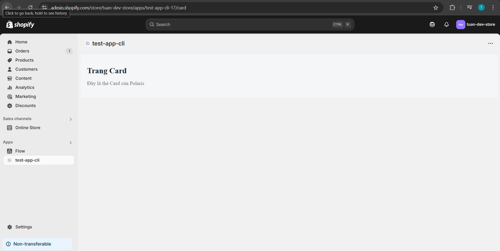
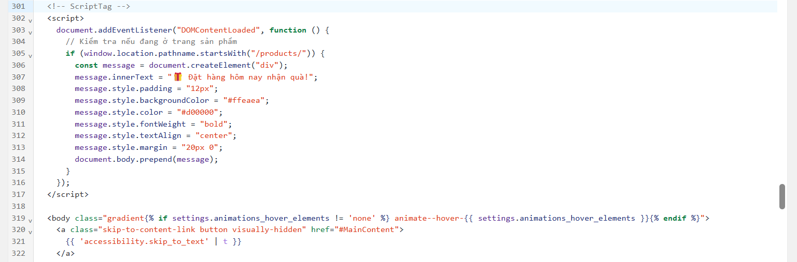
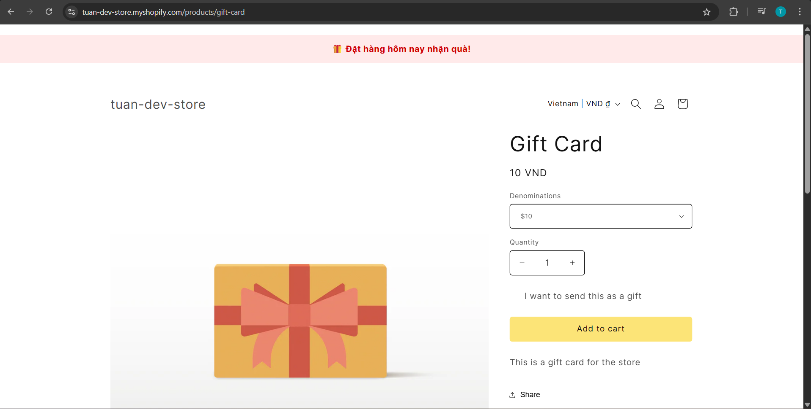
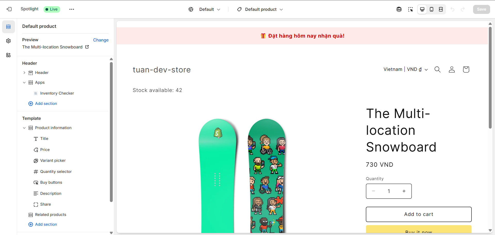
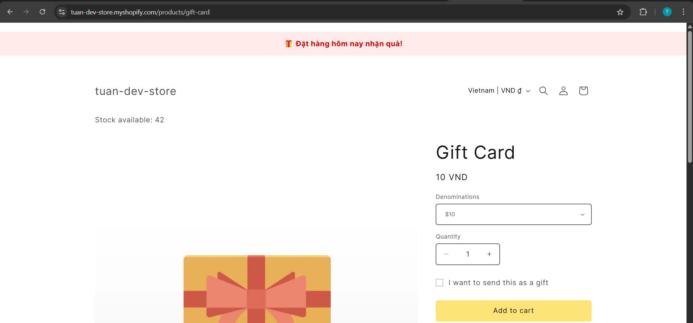

# Làm quen Shopify CLI & Tạo App Mẫu & Shopify Theme & Storefront Interaction

**Nội dung chính**:
- Cài đặt Shopify CLI
- Khởi tạo Project App bằng CLI
- Tìm hiểu cấu trúc folder project
- Tổng quan Shopify Theme - Liquid, Sections, JSON Template
- Cách App tương tác với Storefront
- Cài đặt ScriptTag, App Block vào Theme

**Bài tập** :
- Tạo App mẫu chạy local
- Cài Polaris hiển thị 1 UI component mẫu (Button, Card)
- Inject 1 ScriptTag vào theme product page (hiển thị message "Đặt hàng hôm nay nhận quà")
- Thêm 1 App Block vào Product Page, hiển thị data từ App (ví dụ: tồn kho từ API riêng)

---

## Lý thyết

### 1. Giải thích Folder Structure Project 📁
`.shopify/`
- Chứa cấu hình riêng cho Shopify CLI (ví dụ: thông tin app ID, store, scopes, v.v.)

`app/`
- **Frontend** chính của Shopify App (React + Polaris)
- Đây là nơi bạn viết UI và logic của app chạy trong Admin UI của Shopify.

`extensions/`
- Chứa các Shopify app extensions, như: Checkout UI extension, POS, Admin Action...
- Nếu bạn chưa dùng thì thư mục này có thể trống hoặc chứa extension mẫu.

`shopify.app.toml`: Cấu hình cho **app** phía backend (API key, scopes, redirect URIs...).

`shopify.web.toml`: Cấu hình frontend web app (thường là React host bởi ngrok/local server).


### 2. Tổng quan Shopify Theme - Liquid, Sections, JSON Template

**Shopify Theme** là hệ thống giao diện hiển thị của cửa hàng, bao gồm:

**Liquid (Template Engine)**
- Liquid là ngôn ngữ template được Shopify sử dụng.
- Cho phép bạn **render nội dung động** từ Shopify store: sản phẩm, collections, v.v.
- Cấu trúc cơ bản:
```
{{ product.title }}         {# Output biến #}
  {# Logic điều kiện #}
  In stock

```

**Sections và Blocks**

**1. Sections là gì?**
Sections là các phần giao diện lớn trong theme, cho phép bạn chia layout thành nhiều phần tái sử dụng được.
- Mỗi section được định nghĩa trong thư mục: `sections/`
- Mỗi file section là một file `.liquid` ví dụ: `product-main.liquid`, `featured-products.liquid`
- Có thể chứa:
    - HTML + Liquid (hiển thị nội dung)
    - blocks (các khối con tùy chỉnh)
    - settings (tuỳ chỉnh nội dung từ admin)
```
<section>
  <h1>{{ product.title }}</h1>
  
    <div>{{ block.settings.message }}</div>
  
</section>


{
  "name": "Product Main Section",
  "blocks": [
    {
      "type": "custom_text",
      "name": "Custom Text Block",
      "settings": [
        {
          "type": "text",
          "id": "message",
          "label": "Thông điệp hiển thị"
        }
      ]
    }
  ],
  "presets": [
    {
      "name": "Product Main",
      "category": "Product"
    }
  ]
}

```

**2. Blocks là gì?**
Blocks là các **khối nhỏ bên trong section**, cho phép người dùng thêm/sắp xếp/nội dung động từ Shopify Admin.
- Là thành phần con của section.
- Có thể tạo nhiều block trong 1 section.
- Thêm từ theme editor mà không cần sửa mã nguồn.

🧩 Có 2 loại Blocks:
| Loại              | Mô tả                                                           |
| ----------------- | --------------------------------------------------------------- |
| **Static Block**  | Cố định trong code section, không thay đổi được từ theme editor |
| **Dynamic Block** | Người dùng có thể thêm, xoá, kéo thả từ giao diện theme editor  |

**1. Sections là gì?**
Kể từ Shopify Online Store 2.0, các trang như Product, Collection, Cart, v.v. sử dụng file `.json` trong thư mục `templates/` để định nghĩa bố cục (layout) thay vì hard-code trong .liquid.
🔸 Ví dụ:
- `templates/product.json`: điều khiển giao diện trang chi tiết sản phẩm.
- `templates/index.json`: giao diện trang chủ.
- `templates/collection.json`: trang danh mục sản phẩm.

Mỗi **JSON template** định nghĩa:
- Section nào sẽ xuất hiện.
- Thứ tự của các section.

Ví dụ:
```
{
  "sections": {
    "main": {
      "type": "product-main",
      "settings": {
        "show_vendor": true
      },
      "blocks": {
        "block-1": {
          "type": "text_block",
          "settings": {
            "text": "Sản phẩm hot trong tháng!"
          }
        },
        "block-2": {
          "type": "text_block",
          "settings": {
            "text": "Miễn phí giao hàng toàn quốc"
          }
        }
      }
    }
  },
  "order": ["main"]
}
```

`"main"` là section key
`"type": "product-main"` → Shopify sẽ load `sections/product-main.liquid`
`"blocks"` chứa danh sách block kèm settings tương ứng

Giờ trong `sections/product-main.liquid`, bạn phải lặp qua các block trong Liquid để hiển thị.
→ Mỗi `block` trong `product.json` tương ứng với 1 khối hiển thị cụ thể trên giao diện.

### 3. App tương tác với Storefront như thế nào?
**Storefront** là phần giao diện cửa hàng (frontend) mà khách hàng nhìn thấy (dưới góc nhìn khách hàng) và tương tác khi họ truy cập vào website Shopify của bạn

💡Nói đơn giản:
> **Storefront** = Giao diện người dùng (UI) mà người mua sắm sử dụng để

🧱 Các thành phần chính của Storefront:
| Thành phần            | Vai trò                                                                      |
| --------------------- | ---------------------------------------------------------------------------- |
| **Theme**             | Mẫu giao diện: được viết bằng Liquid, CSS, JS                                |
| **Sections / Blocks** | Các phần trong theme: linh hoạt, kéo thả được                                |
| **Template JSON**     | Định nghĩa layout cho mỗi trang                                              |
| **Assets**            | Hình ảnh, CSS, JS được dùng cho frontend                                     |
| **Storefront APIs**   | Dùng để lấy dữ liệu sản phẩm, giỏ hàng, v.v. (nếu bạn làm custom storefront) |

Shopify Apps có thể tương tác với Storefront thông qua:
- **ScriptTag API**: Dùng để inject script vào trang web.
- **App Blocks**: Hiển thị nội dung ngay trong Theme Editor.
- **Theme App Extension** (mới): Cách chuẩn để thêm block và assets từ app vào theme.

## Bài tập 

### 1. Cài Polaris & Hiển thị Component UI

Code:
```
// test-app-cli/app/routes/card/route.tsx
import { Card, Page } from '@shopify/polaris';
import styles from './styles.module.css';

export default function HomePage() {
  return (
    <Page>
      <div className={styles.container}>
        <h1 className={styles.title}>Trang Card</h1>
        <Card>
          <p className={styles.cardContent}>Đây là thẻ Card của Polaris</p>
        </Card>
      </div>
    </Page>
  );
}

// styles.module.css
.container {
  padding: 20px;
  background-color: #f4f6f8; /* Light gray from Shopify Polaris color palette */
}

.title {
  font-size: 24px;
  font-weight: bold;
  color: #202223; /* Polaris ink color */
  margin-bottom: 12px;
}

.cardContent {
  font-size: 16px;
  color: #6d7175; /* Polaris subtle text */
}
```

Kết quả:



### 2. Inject 1 ScriptTag vào theme product page (hiển thị message "Đặt hàng hôm nay nhận quà")

Code JavaScript:
```
<script>
  document.addEventListener("DOMContentLoaded", function () {
    // Kiểm tra nếu đang ở trang sản phẩm
    if (window.location.pathname.startsWith("/products/")) {
      const message = document.createElement("div");
      message.innerText = "🎁 Đặt hàng hôm nay nhận quà!";
      message.style.padding = "12px";
      message.style.backgroundColor = "#ffeaea";
      message.style.color = "#d00000";
      message.style.fontWeight = "bold";
      message.style.textAlign = "center";
      message.style.margin = "20px 0";
      document.body.prepend(message);
    }
  });
</script>
```

Tiếp theo đó dán code vào file `layout/theme.liquid` (Nằm trong thẻ `head` trước thẻ `body`)



Kết quả:



### 3. Thêm 1 App Block vào Product Page, hiển thị data từ App (ví dụ: tồn kho từ API riêng)

Bước 1: Tạo extension, sửa file `.liquid`:

```
<div id="inventory-checker" data-product-id="{{ product.id }}"></div>

<script>
  document.addEventListener('DOMContentLoaded', function () {
    if (window.location.pathname.startsWith('/products/')) {
      const container = document.getElementById('inventory-checker');

      // Hard-code số lượng tồn kho
      const stock = 42;

      container.innerHTML = `<p>Stock available: ${stock}</p>`;
    }
  });
</script>


{
  "name": "Inventory Checker",
  "target": "section",
  "settings": []
}

```

Bước 2: Deploy extension

Bước 3: Customize theme + Thêm app mình đã deploy



Kết quả:
