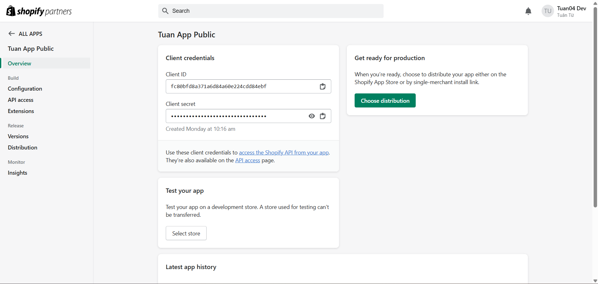
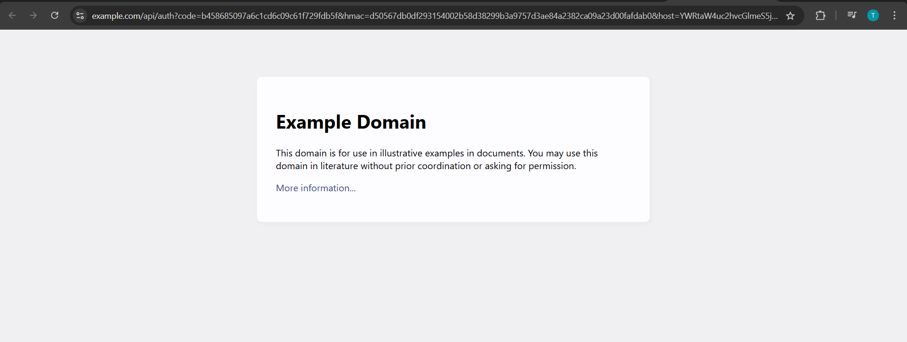
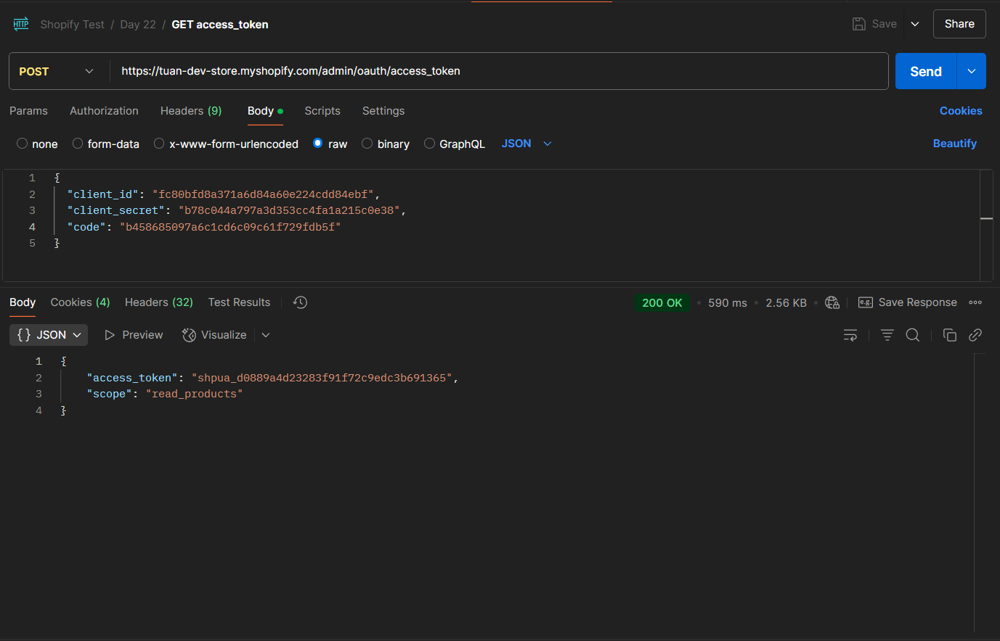
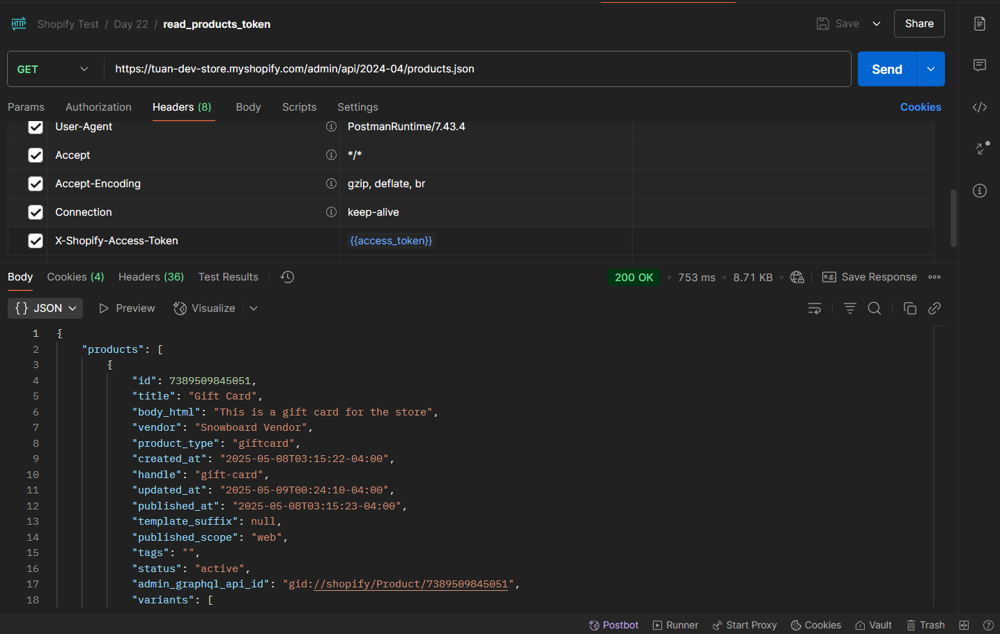
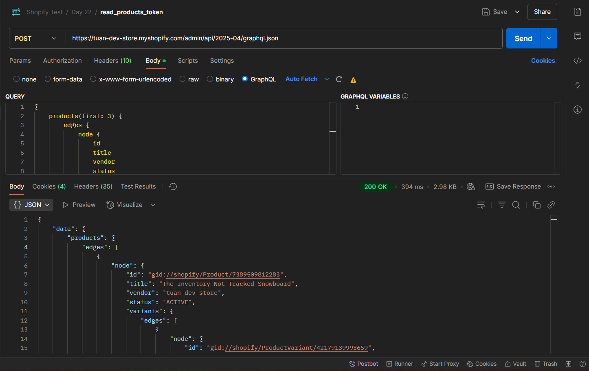
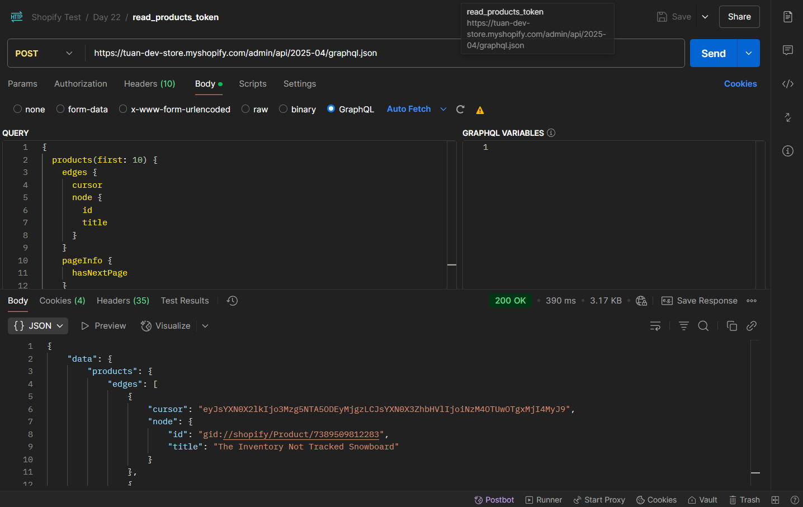

# OAuth Flow & Admin API

**Nội dung chính:**
- Hiểu được **OAuth 2.0 flow trong Shopify App**
- Demo lấy `access_token` & Gọi API
- Demo nâng cao - Dùng GraphQL tối ưu truy vấn API
- Nắm rõ cơ chế xác thực, bảo mật của Shopify App

---

## 1. OAuth 2.0 flow trong Shopify App

>**OAuth 2.0** là **chuẩn ủy quyền** cho phép ứng dụng bên thứ ba (bạn) truy cập tài nguyên (API) của người dùng (chủ shop) mà **không cần biết mật khẩu của họ**

Shopify sử dụng **OAuth 2.0 Authorization Code Flow** để cho phép ứng dụng của bạn truy cập dữ liệu của shop một cách bảo mật và có sự cho phép của chủ shop.

**Các bước chính trong OAuth 2.0 Flow:**

**Bước 1: Redirect người dùng đến trang xác thực của Shopify**

URL mẫu:
`https://{shop}.myshopify.com/admin/oauth/authorize?client_id={API_KEY}&scope={SCOPES}&redirect_uri={REDIRECT_URI}&state={nonce}`

- `{shop}` thay bằng store của bạn, ví dụ: `tuan-dev-store`
- `client_id`: 
- `scope`: Quyền bạn muốn app được cấp (ví dụ: `read_products`, `write_orders`)
- `redirect_uri`: URL mà Shopify sẽ chuyển hướng về sau khi xác thực. Trong môi trường test thì dùng: `https://example.com/api/auth`
- `state`: Chuỗi ngẫu nhiên để chống **CSRF**

**Bước 2: Nhận mã `code` từ Shopify**

Sau khi chủ shop đồng ý cài đặt app, Shopify redirect về:
`https://example.com/api/auth?code={code}&hmac={hmac}&host={host}&shop=tuan-dev-store.myshopify.com&state={state}&timestamp=1747189472`

**Bước 3: Exchange mã `code` để lấy `access_token`**:

Đầu tiền gửi request `POST` như sau:
`https://{shop}.myshopify.com/admin/oauth/access_token`

Payload:
```
{
  "client_id": "API_KEY",
  "client_secret": "API_SECRET",
  "code": "authorization_code"
}
```

Response:
```
{
  "access_token": "shpat_XXX",
  "scope": "read_products,write_orders"
}
```

Bước 4: Gọi các API dựa trên `access_token`

Header: `X-Shopify-Access-Token: <access_token>`

## 2. Demo lấy `access_token` & Gọi API

Đầu tiên: Nếu chưa tạo `Public App` thì phải tạo + Cấp các quyền như (`read_products`, `read_orders`)



**Bước 1: Redirect người dùng đến trang xác thực của Shopify để lấy code**

`https://tuan-dev-store.myshopify.com/admin/oauth/authorize?client_id=fc80bfd8a371a6d84a60e224cdd84ebf&scope=read_products&redirect_uri=https://example.com/api/auth&state=tu_minh_tuan`

Kết quả:


Ta sẽ lấy thấy được `code` ở url: `b458685097a6c1cd6c09c61f729fdb5f`

**Bước 2: Exchange mã `code` để lấy `access_token`**:

Kết quả:


**Bước 2: Gọi thử API: GET /admin/api/2025-04/products.json**:

Kết quả:


## 3. Demo nâng cao - Dùng GraphQL tối ưu truy vấn API

Đầu tiên, sửa lại endpoint: `product.json` -> `graphql.json`

URL: `https://tuan-dev-store.myshopify.com/admin/api/2025-04/graphql.json`

**Lưu ý: Shopify chỉ chấp nhận POST cho GraphQL Admin API** 

Header vẫn thêm `access_token` như gọi **API Product** ban đầu.

1. Truy vấn đơn giản không phân trang

Query GraphQL:
```
{
    products(first: 3) {
        edges {
            node {
                id
                title
                vendor
                status
                variants(first: 2) {
                    edges {
                        node {
                            id
                            title
                            price
                            inventoryQuantity
                        }
                    }
                }
            }
        }
    }
}
```

Kết quả:
```
{
    "data": {
        "products": {
            "edges": [
                {
                    "node": {
                        "id": "gid://shopify/Product/7389509812283",
                        "title": "The Inventory Not Tracked Snowboard",
                        "vendor": "tuan-dev-store",
                        "status": "ACTIVE",
                        "variants": {
                            "edges": [
                                {
                                    "node": {
                                        "id": "gid://shopify/ProductVariant/42179139993659",
                                        "title": "Default Title",
                                        "price": "950",
                                        "inventoryQuantity": 0
                                    }
                                }
                            ]
                        }
                    }
                },
                {
                    "node": {
                        "id": "gid://shopify/Product/7389509845051",
                        "title": "Gift Card",
                        "vendor": "Snowboard Vendor",
                        "status": "ACTIVE",
                        "variants": {
                            "edges": [
                                {
                                    "node": {
                                        "id": "gid://shopify/ProductVariant/42179140026427",
                                        "title": "$10",
                                        "price": "10",
                                        "inventoryQuantity": 0
                                    }
                                },
                                {
                                    "node": {
                                        "id": "gid://shopify/ProductVariant/42179140059195",
                                        "title": "$25",
                                        "price": "25",
                                        "inventoryQuantity": 0
                                    }
                                }
                            ]
                        }
                    }
                },
                {
                    "node": {
                        "id": "gid://shopify/Product/7389509877819",
                        "title": "The Collection Snowboard: Hydrogen",
                        "vendor": "Hydrogen Vendor",
                        "status": "ACTIVE",
                        "variants": {
                            "edges": [
                                {
                                    "node": {
                                        "id": "gid://shopify/ProductVariant/42179140223035",
                                        "title": "Default Title",
                                        "price": "600",
                                        "inventoryQuantity": 50
                                    }
                                }
                            ]
                        }
                    }
                }
            ]
        }
    },
    "extensions": {
        "cost": {
            "requestedQueryCost": 10,
            "actualQueryCost": 10,
            "throttleStatus": {
                "maximumAvailable": 2000.0,
                "currentlyAvailable": 1990,
                "restoreRate": 100.0
            }
        }
    }
}
```

Ảnh demo:



2. Truy vấn phức tạp có sử dụng phân trang

Query GraphQL:
```
{
  products(first: 10) {
    edges {
      cursor
      node {
        id
        title
      }
    }
    pageInfo {
      hasNextPage
    }
  }
}
```

Giải thích `cursor` và `hasNextPage`:
- `cursor`: Là vị trí đánh dấu của một sản phẩm trong danh sách, giúp server biết từ đâu tiếp tục lấy thêm sản phẩm.
- `hasNextPage`: Là `true/false` để cho biết: “Có còn trang tiếp theo không?”.

Kết quả: 
```
{
    "data": {
        "products": {
            "edges": [
                {
                    "cursor": "eyJsYXN0X2lkIjo3Mzg5NTA5ODEyMjgzLCJsYXN0X3ZhbHVlIjoiNzM4OTUwOTgxMjI4MyJ9",
                    "node": {
                        "id": "gid://shopify/Product/7389509812283",
                        "title": "The Inventory Not Tracked Snowboard"
                    }
                },
                {
                    "cursor": "eyJsYXN0X2lkIjo3Mzg5NTA5ODQ1MDUxLCJsYXN0X3ZhbHVlIjoiNzM4OTUwOTg0NTA1MSJ9",
                    "node": {
                        "id": "gid://shopify/Product/7389509845051",
                        "title": "Gift Card"
                    }
                },
                {
                    "cursor": "eyJsYXN0X2lkIjo3Mzg5NTA5ODc3ODE5LCJsYXN0X3ZhbHVlIjoiNzM4OTUwOTg3NzgxOSJ9",
                    "node": {
                        "id": "gid://shopify/Product/7389509877819",
                        "title": "The Collection Snowboard: Hydrogen"
                    }
                },
                {
                    "cursor": "eyJsYXN0X2lkIjo3Mzg5NTA5OTEwNTg3LCJsYXN0X3ZhbHVlIjoiNzM4OTUwOTkxMDU4NyJ9",
                    "node": {
                        "id": "gid://shopify/Product/7389509910587",
                        "title": "The Compare at Price Snowboard"
                    }
                },
                {
                    "cursor": "eyJsYXN0X2lkIjo3Mzg5NTA5OTQzMzU1LCJsYXN0X3ZhbHVlIjoiNzM4OTUwOTk0MzM1NSJ9",
                    "node": {
                        "id": "gid://shopify/Product/7389509943355",
                        "title": "The Draft Snowboard"
                    }
                },
                {
                    "cursor": "eyJsYXN0X2lkIjo3Mzg5NTA5OTc2MTIzLCJsYXN0X3ZhbHVlIjoiNzM4OTUwOTk3NjEyMyJ9",
                    "node": {
                        "id": "gid://shopify/Product/7389509976123",
                        "title": "The Videographer Snowboard"
                    }
                },
                {
                    "cursor": "eyJsYXN0X2lkIjo3Mzg5NTEwMDA4ODkxLCJsYXN0X3ZhbHVlIjoiNzM4OTUxMDAwODg5MSJ9",
                    "node": {
                        "id": "gid://shopify/Product/7389510008891",
                        "title": "The Minimal Snowboard"
                    }
                },
                {
                    "cursor": "eyJsYXN0X2lkIjo3Mzg5NTEwMDQxNjU5LCJsYXN0X3ZhbHVlIjoiNzM4OTUxMDA0MTY1OSJ9",
                    "node": {
                        "id": "gid://shopify/Product/7389510041659",
                        "title": "The Out of Stock Snowboard"
                    }
                },
                {
                    "cursor": "eyJsYXN0X2lkIjo3Mzg5NTEwMDc0NDI3LCJsYXN0X3ZhbHVlIjoiNzM4OTUxMDA3NDQyNyJ9",
                    "node": {
                        "id": "gid://shopify/Product/7389510074427",
                        "title": "The Complete Snowboard"
                    }
                },
                {
                    "cursor": "eyJsYXN0X2lkIjo3Mzg5NTEwMTA3MTk1LCJsYXN0X3ZhbHVlIjoiNzM4OTUxMDEwNzE5NSJ9",
                    "node": {
                        "id": "gid://shopify/Product/7389510107195",
                        "title": "The Hidden Snowboard"
                    }
                }
            ],
            "pageInfo": {
                "hasNextPage": true
            }
        }
    },
    "extensions": {
        "cost": {
            "requestedQueryCost": 6,
            "actualQueryCost": 6,
            "throttleStatus": {
                "maximumAvailable": 2000.0,
                "currentlyAvailable": 1994,
                "restoreRate": 100.0
            }
        }
    }
}
```

Ảnh demo trang đầu tiên (Không cần `after`)



Ảnh demo có sử dụng `after`, là trang tiếp theo:


🧠 Hình dung như đọc sách
- Mỗi `cursor` giống như đánh dấu trang bạn đang đọc.
- `hasNextPage`: `true` nghĩa là còn chương tiếp theo.
- Dùng `after`: `cursor` để lật sang trang kế.

## 4. Cơ chế xác thực, bảo mật của Shopify App

**HMAC Verification**
✅ HMAC (Hash-based Message Authentication Code): Là một cơ chế để xác minh **tính toàn vẹn và xác thực** của dữ liệu. Shopify dùng HMAC để đảm bảo rằng dữ liệu gửi đến App của bạn **không bị giả mạo hoặc chỉnh sửa giữa đường**.

🧾 Khi nào Shopify gửi HMAC?

1. OAuth callback
Khi Shopify redirect lại app sau khi người dùng cài app, URL sẽ có dạng: `https://your-app.com/auth/callback?shop=myshop.myshopify.com&timestamp=12345678&hmac=abc123...`

👉 HMAC ở cuối là chữ ký mà Shopify tạo ra từ các tham số trong URL.

2. Webhooks: Shopify cũng dùng HMAC để ký nội dung webhook, nhưng cách xử lý khác (dùng header).

Bảo mật token
- Access token phải được lưu an toàn (ví dụ: trong database được mã hóa)
- Không nên gửi token về phía frontend
- Shopify access token không hết hạn, nhưng có thể bị revoke nếu app bị gỡ