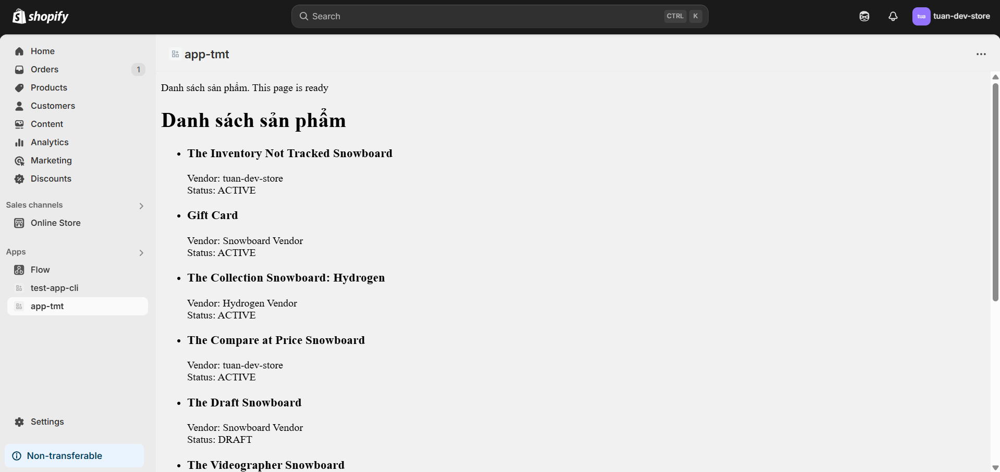

# Tổng quan Remix + Setup Shopify Remix App

**Nội dung chính:**
- Giới thiệu Remix framework
- Vì sao Shopify chọn Remix làm default App framework?
- Setup dự án Remix với Shopify CLI
- Cấu trúc chuẩn 1 Remix Shopify App
- Data Loader, Action, Route in Remix

**Bài tập: Gọi API Shopify để lấy danh sách sản phẩm (GraphQL) -> Sử dụng GraphQL và UI Polaris**

## Lý thuyết

### 1. Giới thiệu Remix framework

**Remix là gì?**
> **Remix** là một **fullstack React framework hiện đại**, tập trung vào hiệu năng, trải nghiệm người dùng và phát triển nhanh.

**Remix làm được những gì?**
| Tính năng                         | Giải thích                                                                    |
| --------------------------------- | ----------------------------------------------------------------------------- |
| ✅ **Server-side rendering (SSR)** | Mỗi request trả về HTML từ server, giúp SEO tốt, load nhanh, không cần chờ JS |
| ✅ **Nested routing**              | Cho phép route con dùng layout của route cha, dễ tổ chức UI phức tạp          |
| ✅ **Data Loaders**                | Truy vấn data **trước khi** render UI, tránh dùng `useEffect` để fetch        |
| ✅ **Actions**                     | Xử lý form gửi dữ liệu về server đơn giản, không cần REST API thủ công        |
| ✅ **Built-in Form support**       | Dùng `<Form>` thay vì viết JS thủ công (tự submit, tự reload UI)              |
| ✅ **Progressive enhancement**     | App vẫn hoạt động nếu người dùng tắt JavaScript                               |
| ✅ **TypeScript, React**           | Dùng được tất cả sức mạnh của React hiện đại + JSX + Tailwind...              |

**📘 Ví dụ minh họa**: `Data loader` vs `useEffect`

Cách cũ (React truyền thống):
```
useEffect(() => {
  fetch('/api/products')
    .then(res => res.json())
    .then(setProducts);
}, []);
```

Cách mới (Remix):
```
export const loader = async () => {
    const res = await fetch('/api/products');
    return res.json();
}

export default function ProductList() {
    const products = useLoaderData();
    return <div>{products.map(p => p.title)}</div>;
}
```

✅ Không cần useEffect → code gọn hơn, hiệu năng tốt hơn, SEO tốt hơn.

### 2. Vì sao Shopify chọn Remix làm default App framework?

> Shopify từng hỗ trợ **Next.js**, nhưng hiện đã chuyển sang **Remix** làm framework mặc định cho các app tích hợp.

🎯 Shopify cần gì? Shopify cần một framework:
- Tích hợp tốt với backend logic (auth, webhooks, API call)
- Load data mượt mà trên các trang admin
- Tốc độ phản hồi cao
- Dễ phát triển nhiều route/phần UI khác nhau trong admin
- Không lệ thuộc quá nhiều vào client-side JavaScript

➡️ Remix đáp ứng rất tốt những điều đó.

| Tiêu chí                | Remix                        | Next.js                                  |
| ----------------------- | ---------------------------- | ---------------------------------------- |
| SSR                     | ✅ Luôn là mặc định           | ✅ Có nhưng tùy config                    |
| Load dữ liệu            | ✅ Loader đơn giản, hiệu quả  | ❌ Phải tự viết API + fetch               |
| Xử lý form              | ✅ Dùng `<Form>` + `action()` | ❌ Phải viết `onSubmit` + fetch           |
| Nested Routes           | ✅ Chuẩn theo React Router    | ✅ Nhưng phải dùng Layout thủ công        |
| Progressive Enhancement | ✅ Hoạt động nếu tắt JS       | ❌ JS là bắt buộc                         |
| SEO                     | ✅ Tốt vì luôn SSR            | ✅ Cũng tốt nếu dùng `getServerSideProps` |
| Shopify CLI support     | ✅ Chính thức hỗ trợ          | ❌ Không còn là mặc định                  |

🛠️ **Cấu trúc Remix phù hợp với Shopify**

Remix giúp bạn:
- Viết các route như `/products`, `/products/$id/edit` → tự động phân tách loader/action
- Dùng `loader` để gọi Shopify GraphQL, REST
- Dùng `action` để submit form tạo hoặc cập nhật sản phẩm
- Dễ dàng thêm xác thực OAuth
- Gắn webhook chỉ với vài dòng code (vì backend logic nằm cùng nơi với frontend)

### 3. Setup dự án Remix với Shopify CLI

1. `npm install -g @shopify/cli @shopify/app`
2. `shopify app init`

### 4. Cấu trúc chuẩn 1 Remix Shopify App

```
/app
  ├─ /routes          ← Các page, route logic
  ├─ /components      ← UI components
  ├─ /loaders         ← API fetch logic
  ├─ /actions         ← Form or mutation logic
  ├─ /entry.server.tsx
  └─ root.tsx         ← Layout gốc
/shopify
  ├─ webhooks.ts      ← Webhook handler
  ├─ auth.ts          ← OAuth logic
  └─ api.server.ts    ← Shopify API call helpers

  ... Còn nhiều
```

### 5. Concepts quan trọng trong Remix

| Concept            | Mô tả                                                           |
| ------------------ | --------------------------------------------------------------- |
| **Route**          | Mỗi file trong `/routes` là một page riêng                      |
| **Loader**         | Hàm server-side fetch data trước khi hiển thị page              |
| **Action**         | Hàm xử lý form submissions, mutations...                        |
| **Nested Routes**  | Route có thể lồng nhau, ví dụ: `/products/$id/edit`             |
| **Form + Fetcher** | Gửi form mà không cần viết JS — dùng `<Form>` và `useFetcher()` |

## Bài tập

1. `components/ShopifyClient.server.ts`: Hàm fetch data từ API admin
```
interface IProduct {
  id: string
  title: string
  vendor: string
  status: string
}

interface IProductEdge {
  node: IProduct
}

export async function fetchProducts(shop: string, accessToken: string) {
  const endpoint = `https://${shop}/admin/api/2025-04/graphql.json`;

  const query = `
    {
      products(first: 10) {
        edges {
          node {
            id
            title
            vendor
            status
          }
        }
      }
    }
  `;

  const res = await fetch(endpoint, {
    method: "POST",
    headers: {
      "Content-Type": "application/json",
      "X-Shopify-Access-Token": accessToken,
    },
    body: JSON.stringify({ query }),
  });

  const json = await res.json();
  return json.data.products.edges.map((edge: IProductEdge) => edge.node)
}
```

2. `loaders/productLoader.ts`: Tách loader ra file riêng cho dễ quản lý:
```
import type { LoaderFunctionArgs } from "@remix-run/node";
import { fetchProducts } from "../routes/components/ShopifyClient.server";

export async function productsLoader({ request }: LoaderFunctionArgs) {
  console.log("SHOP ENV:", process.env.shop);
  console.log("ACCESS TOKEN ENV:", process.env.accessToken);

  const products = await fetchProducts(
    process.env.shop as string,
    process.env.accessToken as string,
  );

  return { products };
}
```

3. `products.tsx`
```
import { useLoaderData } from "@remix-run/react";
import { Card, Page, ResourceList, Text } from "@shopify/polaris";
import { productsLoader } from "app/loaders/productsLoader";

export const loader = productsLoader;

export default function ProductList() {
  const { products } = useLoaderData<typeof loader>();

  return (
    <Page title="Danh sách sản phẩm">
      <Card>
        <ResourceList
          resourceName={{ singular: "product", plural: "products" }}
          items={products}
          renderItem={(product) => {
            const { id, title, vendor, status } = product;
            return (
              <ResourceList.Item id={id} url="#" accessibilityLabel={`View details for ${title}`}>
                <Text variant="bodyMd" fontWeight="bold" as="h3">
                  {title}
                </Text>
                <div>Vendor: {vendor}</div>
                <div>Status: {status}</div>
              </ResourceList.Item>
            );
          }}
        />
      </Card>
    </Page>
  );
}
```

Kết quả:

