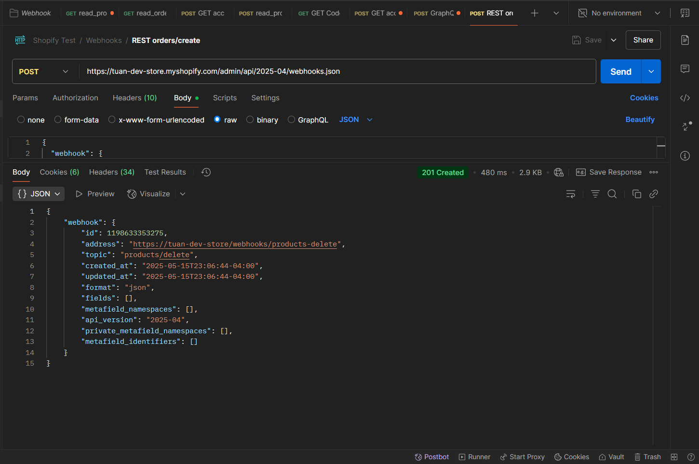
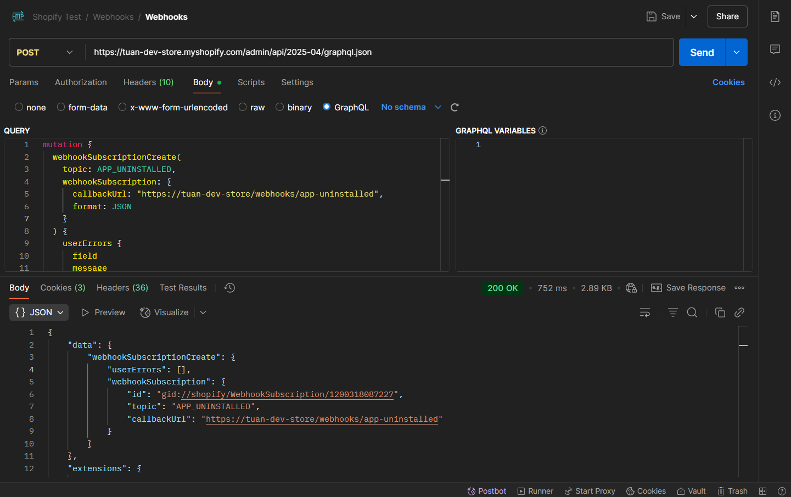

# Shopify Webhooks

Nội dung chính:
- Tổng quan về Webhook trong Shopify
- Đăng ký webhook (REST & GraphQL)
- Xử lý webhook trong Remix App
- Các webhook quan trọng: orders/create, app/uninstalled

## Lý thuyết

### 1. Tổng quan về Webhook trong Shopify

**✅ Webhook là gì?**
**Webhook** là một cách để **một hệ thống gửi dữ liệu tự động** đến một hệ thống khác khi có sự kiện xảy ra. Đây là một kỹ thuật **"push"** dữ liệu chủ động, trái ngược với việc hệ thống kia phải tự hỏi ("poll") liên tục để kiểm tra xem có gì mới không.

> 👉 Nói đơn giản: **Webhook** giống như **cuộc gọi điện tự động** khi có việc xảy ra. Không cần bạn hỏi, hệ thống sẽ chủ động báo cho bạn biết.

**⚙️ Cách hoạt động của Webhook**

1. **Bên A (ví dụ: Shopify)** xảy ra sự kiện (ví dụ: đơn hàng mới được tạo).
2. Bên A gửi **HTTP request (thường là POST)** chứa dữ liệu sự kiện đến **URL do bên B (bạn) đăng ký** từ trước.
3. Bên B nhận và xử lý dữ liệu — ví dụ: lưu vào DB, gửi email, cập nhật dashboard...

**🛡️ Xác thực Webhook (Security)**
- Webhook thường đi kèm với một **HMAC (hash)**, để xác minh rằng dữ liệu đến từ bên đáng tin (chứ không phải giả mạo).
- Bạn dùng secret key (được cấp sẵn) để tạo HMAC trên payload rồi so sánh với HMAC do bên gửi cung cấp.
- Nếu trùng → dữ liệu hợp lệ. Nếu khác → có thể bị giả mạo → từ chối.

**🧩 Thành phần cơ bản của một Webhook**
| Thành phần          | Mô tả                                               |
| ------------------- | --------------------------------------------------- |
| **Event**           | Tên sự kiện xảy ra (e.g., `order.created`)          |
| **Payload**         | Dữ liệu JSON gửi kèm mô tả chi tiết sự kiện         |
| **Target URL**      | URL nhận webhook (phía server của bạn)              |
| **HTTP Method**     | Thường là `POST`                                    |
| **Header xác thực** | HMAC hoặc token để kiểm tra tính hợp lệ của request |

**Ưu điểm của webhook:**

- Real-time (gần như ngay lập tức).
- Giảm việc poll API liên tục.
- Tiết kiệm tài nguyên & tăng hiệu năng app.

### 2. Đăng ký webhook (REST & GraphQL)

**Shopify** cho phép bạn đăng ký webhook để nhận thông báo khi các sự kiện quan trọng xảy ra, ví dụ như:
- `orders/create`: khi có đơn hàng mới.
- `products/update`: khi sản phẩm được cập nhật.
- `app/uninstalled`: khi merchant gỡ cài đặt app của bạn.

#### 2.1. Các cách đăng ký webhook (4 cách)

| Cách                     | API                                                  | Mô tả                                                     |
| ------------------------ | ---------------------------------------------------- | --------------------------------------------------------- |
| **REST API**             | `/admin/api/{version}/webhooks.json`                 | Đăng ký webhook truyền thống, dễ dùng, rõ ràng            |
| **GraphQL API**          | Mutation `webhookSubscriptionCreate`                 | Mạnh hơn, cho phép đăng ký với nhiều tùy chọn             |
| **Shopify CLI (config)** | `shopify.app.toml`                                   | Dùng trong quá trình phát triển, CLI sẽ tự deploy webhook |
| **Admin UI**             | Trong trang admin Shopify > Settings > Notifications | Thủ công (ít dùng với custom app)                         |

#### 2.2. Đăng ký webhook bằng REST API

`POST https://tuan-dev-store.myshopify.com/admin/api/2025-04/webhooks.json`

**Header**: `X-Shopify-Access-Token: {{accessToken}}`

**Body**:
```
{
  "webhook": {
    "topic": "products/delete",
    "address": "https://tuan-dev-store/webhooks/products-delete",
    "format": "json"
  }
}
```

**Kết quả**:



#### 2.3 Đăng ký webhook bằng GraphQL

Topic: `APP_UNINSTALLED`

