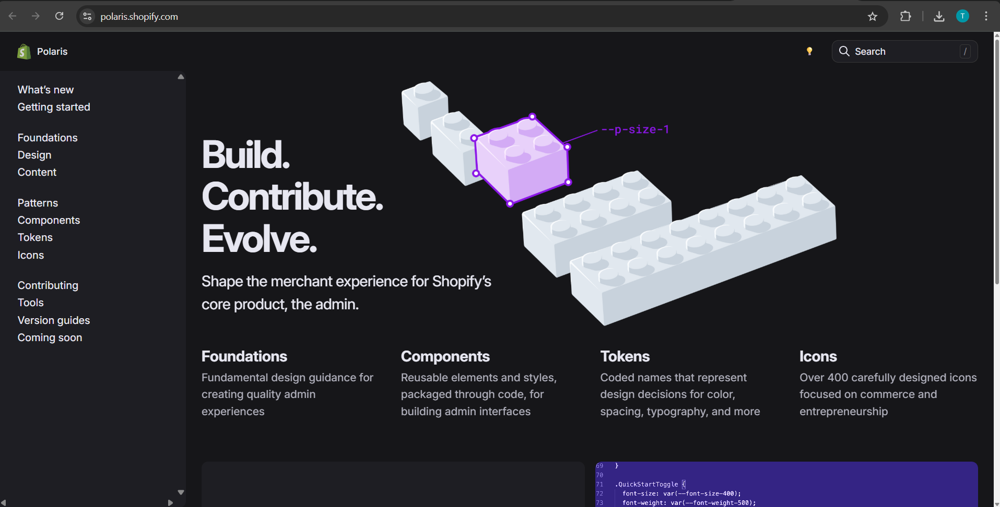
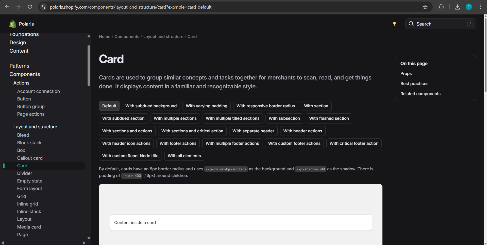
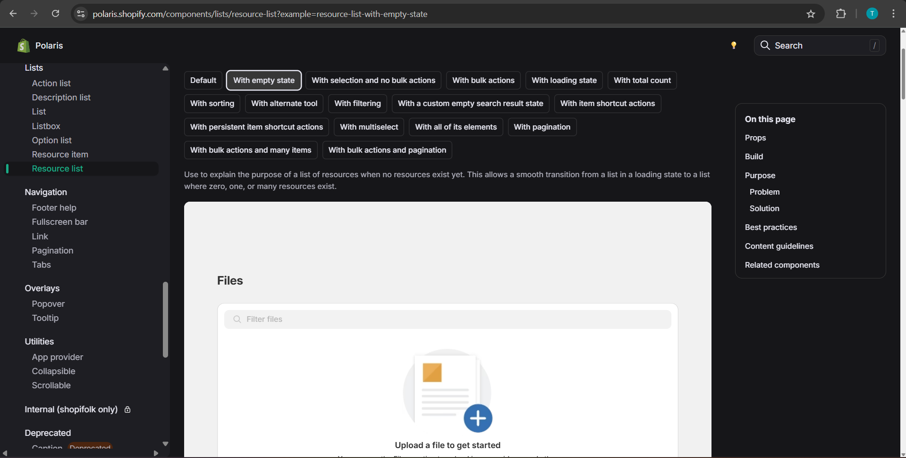
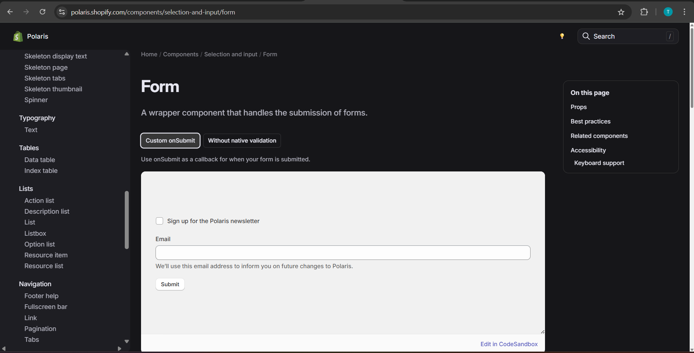
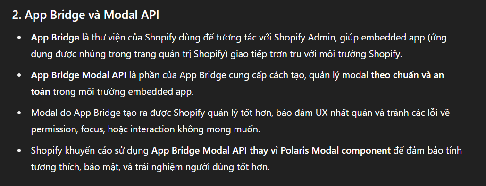
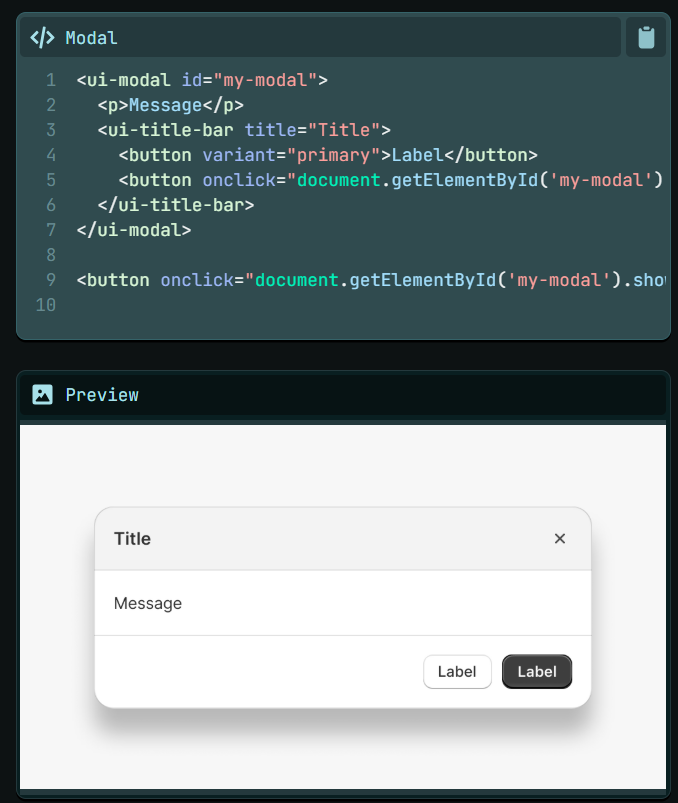
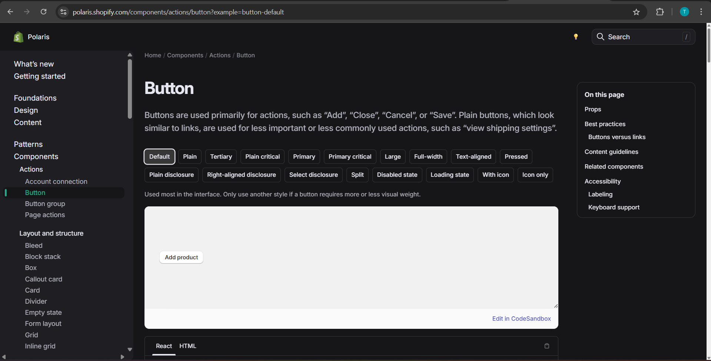
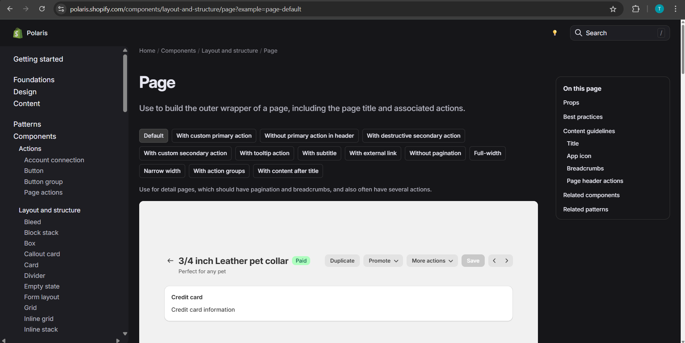
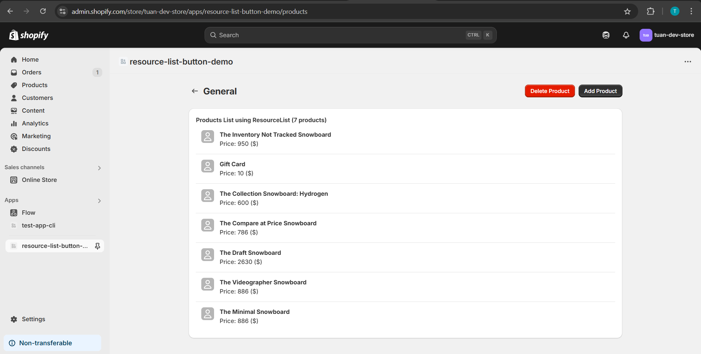

# Shopify Polaris & UI Advanced

**Nội dung chính:**

- Tìm hiểu Polaris Design System
- Các component quan trọng (Card, ResourceList, Form, Modal…)
- Kết hợp Polaris + Remix để build UI

**Bài tập**

- Render danh sách Product bằng Polaris `ResourceList`
- Thêm Button thêm/xóa product giả lập

## Lý thuyết

### Polaris Design System

**✅ Polaris Design System là gì?**
Polaris là hệ thống thiết kế UI của Shopify, cung cấp các component React chuẩn giúp bạn xây dựng giao diện admin app đồng nhất với UI của Shopify.

**Link tài liệu chính thức**: https://polaris.shopify.com



- Foundation (Nền tảng): Hướng dẫn thiết kế cơ bản để tạo ra trải nghiệm quản trị chất lượng
- Components: Các thành phần và kiểu dáng có thể tái sử dụng, được đóng gói bằng mã, dùng để xây dựng giao diện quản trị
- Tokens: Các tên mã đại diện cho quyết định thiết kế về màu sắc, khoảng cách, kiểu chữ và nhiều yếu tố khác..
- Icons: Hơn 400 icon được thiết kế cẩn thận, tập trung vào thương mại và khởi nghiệp

### Các component quan trọng (Card, ResourceList, Form, Modal…)

#### 1. Card

**Card**: được sử dụng để nhóm các khái niệm và tác vụ liên quan lại với nhau, giúp người bán dễ dàng quét qua, đọc và thực hiện công việc. Nó hiển thị nội dung theo một kiểu dáng quen thuộc và dễ nhận biết

Link: https://polaris.shopify.com/components/layout-and-structure/card?example=card-default

Minh hoạ:



#### 2. ResourceList

**ResourceList (Danh sách tài nguyên)**: hiển thị một bộ sưu tập các đối tượng cùng loại, chẳng hạn như sản phẩm hoặc khách hàng. Nhiệm vụ chính của danh sách tài nguyên là giúp người bán **tìm một đối tượng và điều hướng đến trang chi tiết đầy đủ** của đối tượng đó.

Link: https://polaris.shopify.com/components/lists/resource-list?example=resource-list-default

Minh hoạ:



#### 3. Form

A wrapper component that handles the submission of forms

Link: https://polaris.shopify.com/components/selection-and-input/form?example=form-custom-on-submit

Minh hoạ:



#### 4. Modal

**Modal** là các lớp phủ yêu cầu người bán thực hiện một hành động trước khi có thể tiếp tục tương tác với phần còn lại của Shopify. Chúng có thể gây gián đoạn và cần được sử dụng một cách cẩn trọng và tiết chế.

Link: https://polaris.shopify.com/components/deprecated/modal

> Tuy nhiên đã bị **Deprecated** -> Sử dụng **App Bridge Modal API** để thay thế

**Lý do**: Modal dạng này không hoàn toàn tương tác tốt với các app Shopify được nhúng trong admin (Shopify Admin Embedded Apps) hoặc không đáp ứng đủ các yêu cầu kỹ thuật, bảo mật, hoặc UX chuẩn mới.

Bổ sung về App Bridge:



Ví dụ sử dụng:



#### 5. Button

Buttons are used primarily for actions, such as “Add”, “Close”, “Cancel”, or “Save”. Plain buttons, which look similar to links, are used for less important or less commonly used actions, such as “view shipping settings”.

Link: https://polaris.shopify.com/components/actions/button

Minh hoạ:



#### 6. Page

Use to build the outer wrapper of a page, **including the page title and associated actions**.

Link: https://polaris.shopify.com/components/layout-and-structure/page?example=page-default

Minh hoạ:



### 🤝 Polaris + Remix

**Polaris** cần bao bọc app bằng `AppProvider` và cần `theme/context` chuẩn của Shopify.

Ví dụ :
```
export const links = () => [{
  rel: "stylesheet", href: polarisStyles
}];

// ...

<AppProvider apiKey={apiKey} i18n={enTranslations}>
    <Outlet />
</AppProvider>
```

## Bài tập

- Render danh sách Product bằng Polaris `ResourceList`
- Thêm Button thêm/xóa product giả lập

Chi tiết các bước thực hiện:

- Bước 1: Tạo Project Remix + Shopify: `resource-list-button-demo`
- Bước 2: Tạo `/products/route.tsx`
- Bước 3: Dùng `LoaderFunction` để fetch dữ liệu sản phẩm từ **Shopify Admin API**

```
export const loader: LoaderFunction = async () => {
    // GraphQL query để lấy 7 sản phẩm đầu tiên với variant đầu tiên
    const query = `
        {
        products(first: 7) {
            edges {
            node {
                id
                title
                variants(first: 1) {
                edges {
                    node {
                    price
                    }
                }
                }
            }
            }
        }
        }
    `;

    // Gọi API của Shopify Admin bằng fetch
    const response = await fetch('https://tuan-dev-store.myshopify.com/admin/api/2025-04/graphql.json', {
        method: 'POST',
        headers: {
            'Content-Type': 'application/json',
            // Dùng Access Token từ biến môi trường
            'X-Shopify-Access-Token': process.env.SHOPIFY_ADMIN_API_TOKEN as string,
        },
        body: JSON.stringify({ query }), // Gửi query GraphQL
    });

    const result = await response.json(); // Parse response thành JSON

    // Parse dữ liệu sản phẩm trả về thành mảng đơn giản với id, title, price
    const parsedProducts = result.data.products.edges.map((edge: any) => ({
        id: edge.node.id,
        title: edge.node.title,
        price: edge.node.variants.edges[0]?.node.price ?? '$0.00', // fallback nếu không có variant
    }));

    return parsedProducts; // Trả dữ liệu cho useLoaderData phía client
};
```

- Bước 4: Component chính hiển thị danh sách sản phẩm, sử dụng (Page, Button, Card, ResourceList, **ResourceItem**, Avatar, Text) từ `@shopify/polaris`

```
export default function Products() {
    // useLoaderData để GETs Data
    const products = useLoaderData<typeof loader>();

    return (
        <Page
            backAction={{ content: 'Settings', url: '/app' }}
            title="General"
            primaryAction={<Button variant="primary">Add Product</Button>}
            secondaryActions={<Button variant="primary" tone="critical">Delete Product</Button>}
        >
            <Card>
                <Text as="h2" variant="headingSm">
                    Products List using ResourceList (7 products)
                </Text>
                <ResourceList
                    resourceName={{ singular: 'product', plural: 'products' }}
                    items={products}
                    renderItem={(item) => {
                        const { id, title, price } = item;
                        const media = <Avatar customer size="md" name={title} />;

                        return (
                            <ResourceItem
                                id={id}
                                url="#"
                                media={media}
                                accessibilityLabel={`View details for ${title}`}
                            >
                                <Text variant="bodyMd" fontWeight="bold" as="h3">
                                    {title}
                                </Text>
                                <div>Price: {price} ($)</div>
                            </ResourceItem>
                        );
                    }}
                >

                </ResourceList>
            </Card>
        </Page>
    );
}
```

Kết quả giao diện:


