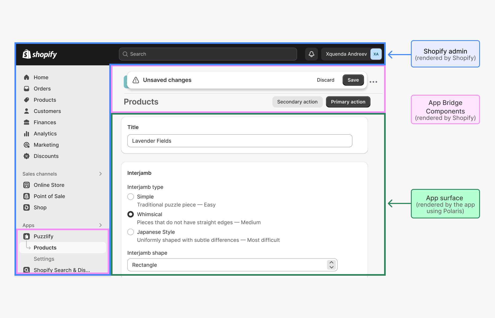

# Shopify React Hooks + API Admin nâng cao

**Nội dung chính**:

- Shopify `useAppBridge`, `useAuthenticatedFetch`
- Call Shopify Admin API qua App Bridge
- Pagination / Filter / Query param

**Bài tập**:

- Tạo trang `/admin-products`
- Call thật Shopify Admin API (GraphQL)
- Hiển thị danh sách sản phẩm có filter theo title

## Lý thuyết

### 1. Shopify `useAppBridge`, `useAuthenticatedFetch`

#### About Shopify App Bridge

The App Bridge library provides APIs that enable Shopify apps to render UI in the Shopify **app home** surface. (Thư viện App Bridge cung cấp các API cho phép ứng dụng Shopify hiển thị giao diện người dùng (UI) trên bề mặt trang chủ ứng dụng trong Shopify.)

Apps built with Shopify App Bridge are more performant (hiệu suất cao), flexible (linh hoạt), and seamlessly integrate (tích hợp mượt mà) with the Shopify admin. You can use Shopify App Bridge with `Polaris` to provide a consistent (nhất quán) and intuitive (trực quan) user experience that matches the rest of the Shopify admin.

> **Note**: App Bridge components don't render as part of the app's component hierarchy. They are React-like wrappers around JavaScript messages that communicate with the Shopify admin. The Shopify admin does the UI rendering. (Tạm dịch: Các thành phần của App Bridge không được render như một phần của cây component trong ứng dụng của bạn. Chúng là các "wrapper giống React", thực chất là các thông điệp JavaScript giao tiếp với Shopify Admin. Phần hiển thị UI thật sự sẽ do Shopify Admin đảm nhiệm.)



App Bridge cho phép bạn thực hiện các việc sau từ trang chủ của ứng dụng:

- Hiển thị menu điều hướng ở bên trái trong giao diện quản trị Shopify.
- Hiển thị thanh lưu (save bar) theo ngữ cảnh phía trên thanh tiêu đề (top bar) của Shopify admin.
- Hiển thị thanh tiêu đề (title bar) có chứa các hành động chính (primary) và phụ (secondary).

App Bridge chủ yếu dùng để hỗ trợ frontend (trong iframe) kết nối với Shopify Admin, truyền token vào fetch, dùng Resource Picker, TitleBar, Toast, v.v.

#### `useAppBridge` + `useAuthenticatedFetch`

- `useAppBridge()` – truy cập app bridge instance.
- `useAuthenticatedFetch(app)` – tạo ra hàm fetch đã được gắn token xác thực OAuth để gọi Admin API an toàn từ frontend.

### 2. Call Shopify Admin API qua App Bridge

Code:
```
    const result = await window.shopify.resourcePicker({
      type: "product",
      action: "select",
    });
```

Bạn không thấy gọi trực tiếp tới `createApp` hoặc `useAppBridge()` — nhưng vẫn sử dụng được **App Bridge**. Vì sao?

1. `window.shopify.resourcePicker` từ đâu mà có?

`window.shopify.resourcePicker` là một **API tiện ích được App Bridge inject vào window** khi:
- Bạn đang chạy một embedded Shopify app (tức là được nhúng trong admin).
- App của bạn có App Bridge được cấu hình đúng (`<AppProvider>`).

### 3. Pagination / Filter / Query param

#### a. Pagination

Shopify sử dụng **Relay-style cursor-based pagination**, không như `offset-based` của REST.

Ví dụ: Lấy danh sách 10 sản phẩm đầu tiên
```
query {
  products(first: 10) {
    edges {
      node {
        id
        title
      }
      cursor
    }
    pageInfo {
      hasNextPage
      hasPreviousPage
    }
  }
}
```

Lấy trang kế tiếp (dùng `after`):
```
query {
  products(first: 10, after: "cursor_từ_lần_trước") {
    edges {
      node {
        id
        title
      }
      cursor
    }
    pageInfo {
      hasNextPage
    }
  }
}
```

#### b. Filtering / Search (Query parameters)

`Filter` bằng tham số query – rất giống cách tìm kiếm trong admin Shopify.

Ví dụ:
```
query {
  products(first: 10, query: "title:Shirt") {
    edges {
      node {
        id
        title
      }
    }
  }
}
```

Mẫu truy vấn kết hợp Pagination + Filter:
```
query GetFilteredProducts($first: Int!, $after: String) {
  products(first: $first, after: $after, query: "vendor:Adidas tag:featured") {
    edges {
      node {
        id
        title
        vendor
        tags
      }
      cursor
    }
    pageInfo {
      hasNextPage
    }
  }
}
```

#### c. Lưu ý khi làm Pagination và Filter

- **Cursor (Relay)**: Luôn lưu lại `cursor` để phân trang chính xác.
- **Query too complex**: Nếu bạn truyền filter phức tạp và quá nhiều trường trong `node`, Shopify sẽ trả lỗi. Tối ưu truy vấn bằng cách chọn chỉ trường bạn cần

## Bài tập

- Tạo trang `/admin-products`
- Call thật Shopify Admin API (GraphQL)
- Hiển thị danh sách sản phẩm có filter theo title